#Docker   常用的知识


##阿里云镜像加速
```shell
# 创建文件
sudo mkdir -p /etc/docker
# 修改配置, 设置镜像
sudo tee /etc/docker/daemon.json <<-'EOF'
{
  "registry-mirrors": ["https://vw9qapdy.mirror.aliyuncs.com"]
}
EOF
# 重启后台线程
sudo systemctl daemon-reload
# 重启docker
sudo systemctl restart docker
```

##mysql 启动 和 配置
```shell
docker 上 拉取mysql
sudo docker pull mysql:8.0
启动mysql
docker run -p 3306:3306 --name mysql8 -v /usr/mydata/mysql/log:/var/log/mysql -v /usr/mydata/mysql/data:/var/lib/mysql -v /usr/mydata/mysql/conf:/etc/mysql/conf.d -e MYSQL_ROOT_PASSWORD=root -d mysql:8.0


1. 进入挂载的mysql配置目录
cd /usr/mydata/mysql/conf    根据自己挂载路径来

2. 修改配置文件 my.cnf
vi my.cnf
加入内容
[client]
default-character-set=utf8
[mysql]
default-character-set=utf8
[mysqld]
init_connect='SET collation_connection = utf8_unicode_ci'
init_connect='SET NAMES utf8'
character-set-server=utf8
collation-server=utf8_unicode_ci
skip-character-set-client-handshake
skip-name-resolve

3. docker重启mysql使配置生效
docker restart mysql8

4.容器随docker启动自动运行
# mysql
docker update mysql8 --restart=always
```
##redis 启动 和 配置
```shell
1.docker 拉取 redis
docker pull redis

2.docker启动redis
因为没有 redis.conf文件, 得先创建文件夹 再进行启动挂载
mkdir -p /mydata/redis/conf
touch /mydata/redis/conf/redis.conf
启动redis 命令
docker run -p 6379:6379 --name redis \
-v /mydata/redis/data:/data \
-v /mydata/redis/conf/redis.conf:/etc/redis/redis.conf \
-d redis redis-server /etc/redis/redis.conf

3.redis 持久化配置
echo "appendonly yes"  >> /mydata/redis/conf/redis.conf
# 重启生效
docker restart redis

4.容器随docker启动自动运行
# redis
docker update redis --restart=always
```


##初始Dockerfile
```shell
# Dockerfile 就是用来构建docker镜像的构建文件！ 脚本命令 
# 通过这个脚本可以生成镜像,镜像一层一层的，脚本是一个个的命令,每个命令都是一层;
```
```shell
# 创建一个dockerfile文件，名字可以自己取，
# 文件中的内容
FROM centos

VOLUME ["volume01","volume02"]

CMD echo "----cgcg----"

CMD /bin/bash

# 上面每个命令都是镜像的一层.
```
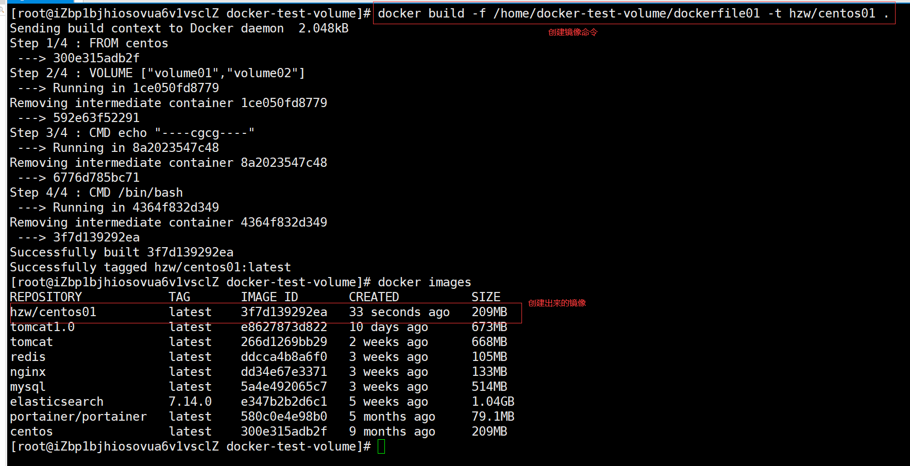
```shell
#启动下自己写的容器
```
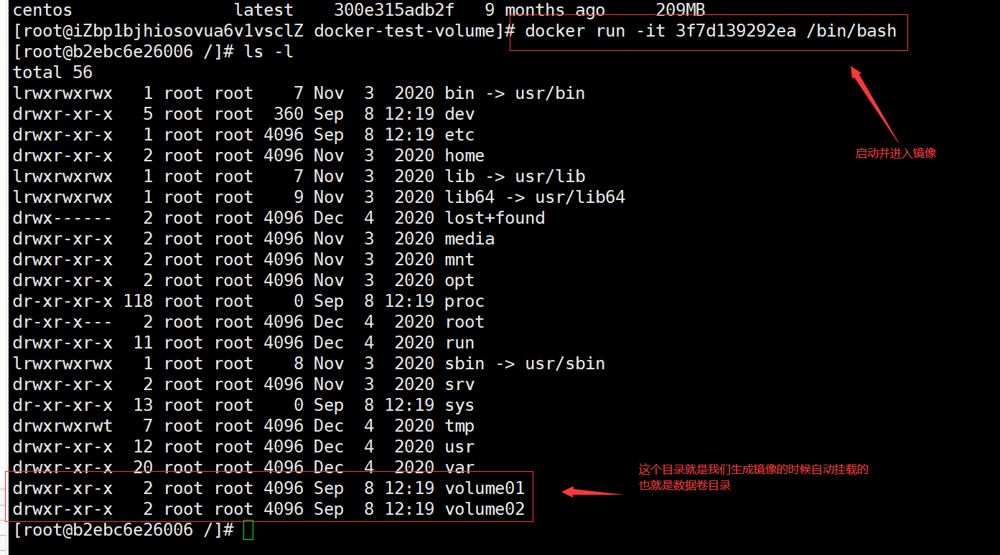
```shell
这卷和外部一定有一个同步的目录
```
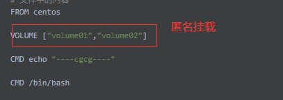
```shell
查看一下卷挂载的路径
```
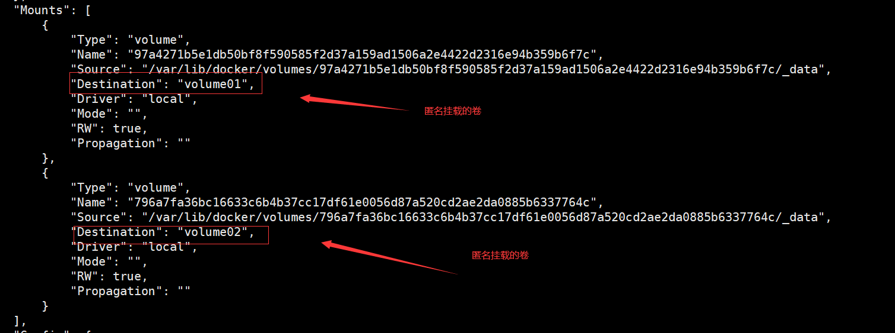
```shell
验证一下文件是否同步出去了
这种方式未来使用的十分多,因为我们通常会构建自己的镜像
假设构建镜像的时候没有挂载卷,要手动自动挂载 -v 卷名 容器内路径!
```
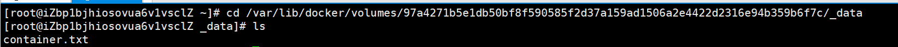
##数据卷容器
```shell
多个MySQL同步数据
```
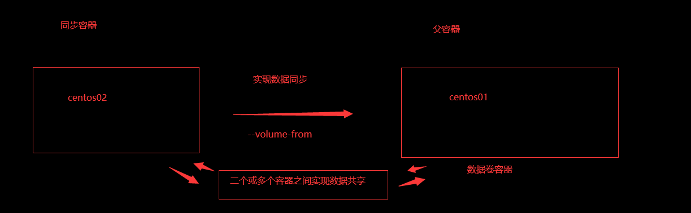
```shell
# 启动3个容器进行测试, 通过刚刚自己的写的镜像启动
```
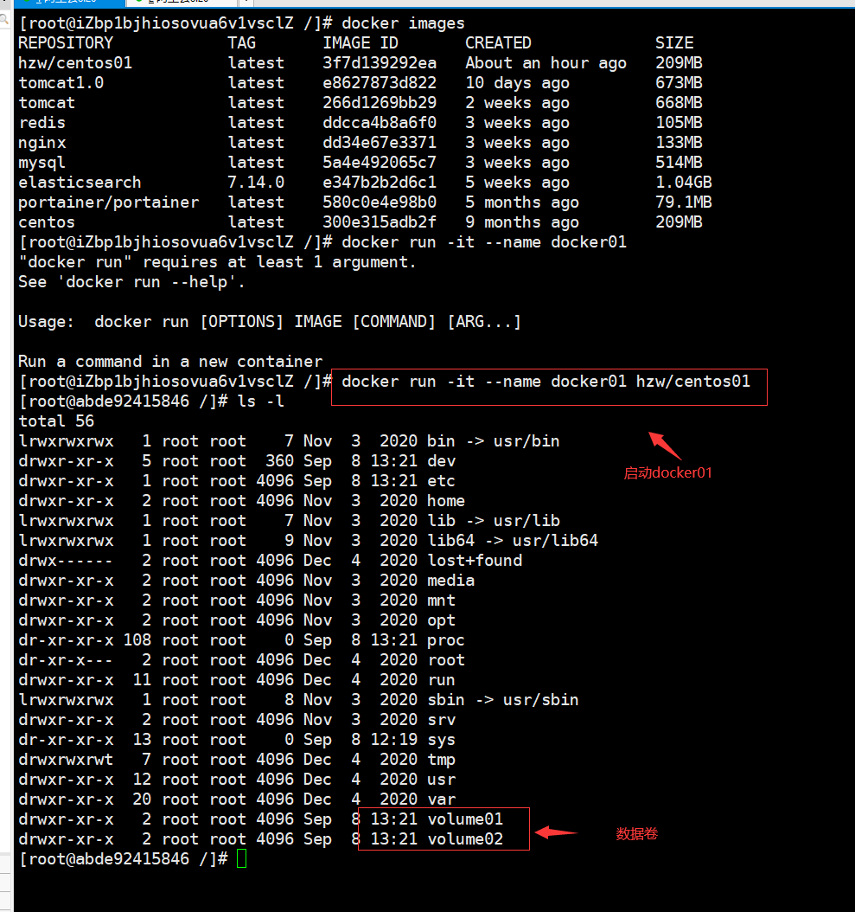
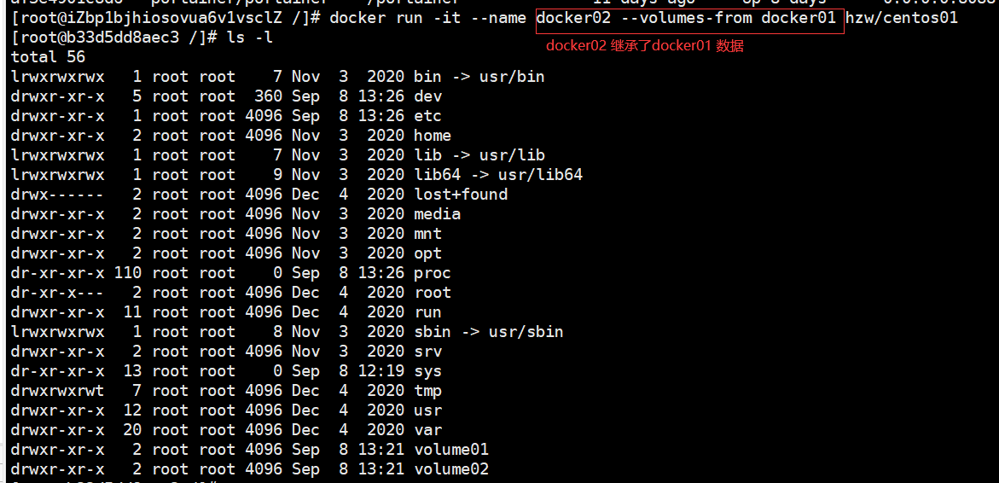
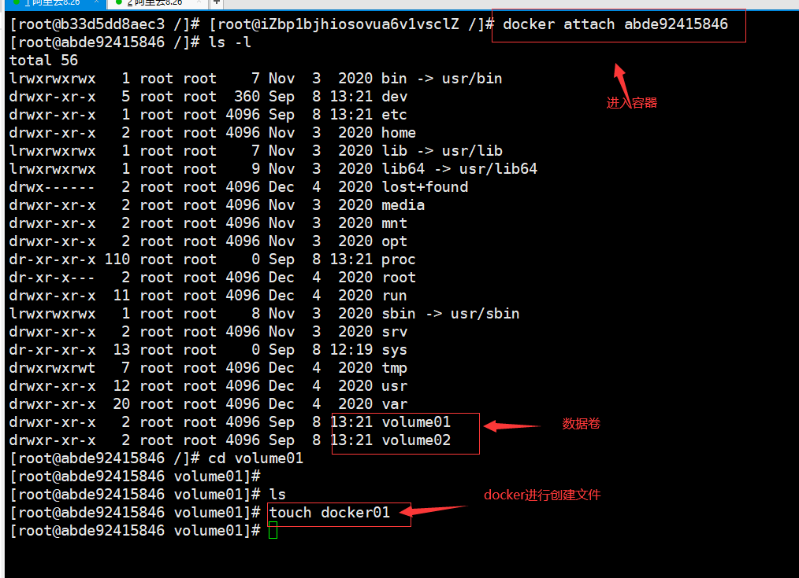
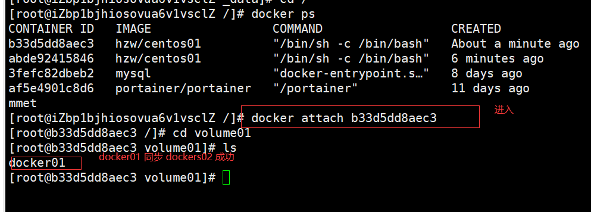
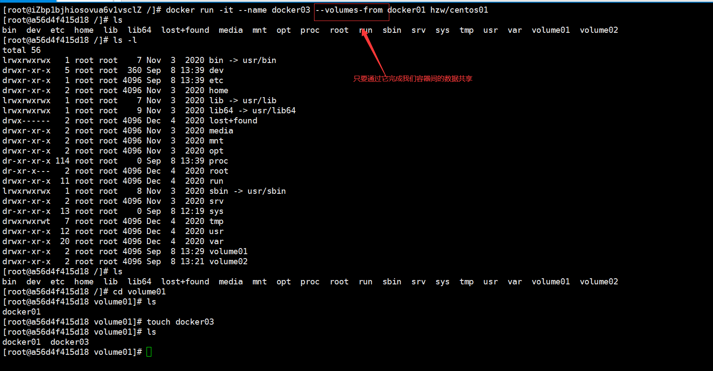
```shell
得出结论,相互共享的容器,删除其中任何一个容器,不影响其他容器数据
```
>DockerFile

###dockerFile 是用来构建docker镜像的文件！ 命令参数脚本！
```shell
1.编写一个docker文件
2.docker build 构建成为一个镜像
3.docker run 运行镜像
4.docker push 发布镜像 (发布到DockerHub 阿里云镜像仓库!)
```
###查看官方是怎么做镜像的？
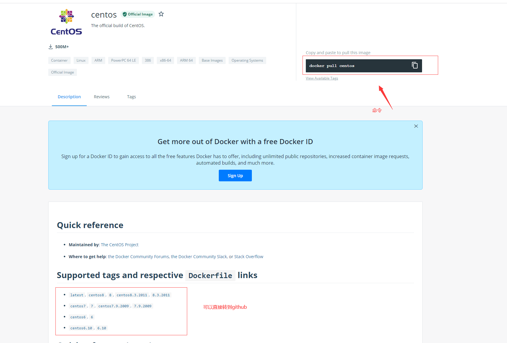
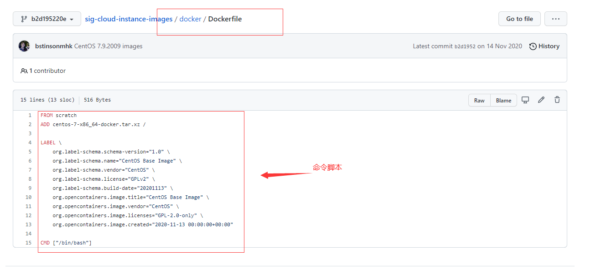
###很多官方镜像都是基础包,很多功能都不是很完善,我们通常会自己搭建自己的镜像!
###官方既然可以做镜像，那我们也可以做一个属于自己的镜像!
>DockerFile 构建过程

```shell
基础知识
1.每个保留关键字(指令)都是必须是大写字母
2.执行从上到下顺序执行
3.# 表示注释
4.每个指令都会生成新的镜像层,并提交!
```
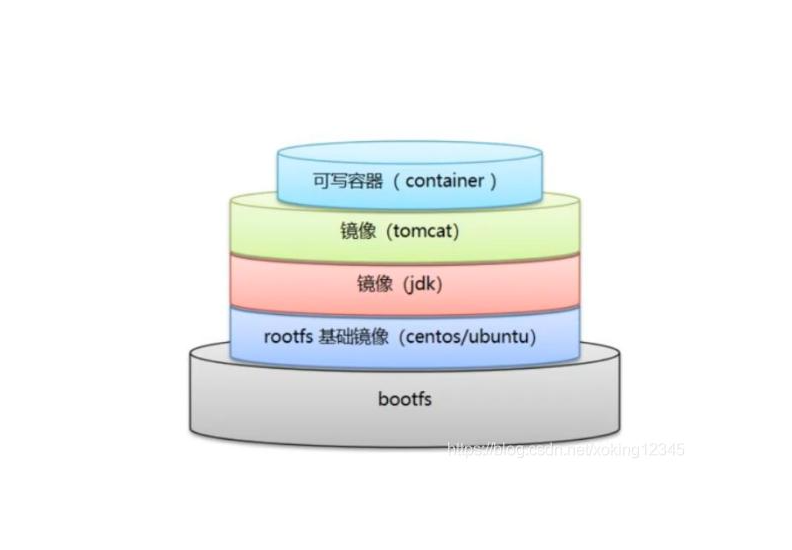
```shell
dockerfile都是面向开发的,我们以后要发布项目,就需要编写dockerfile文件,这个文件十分简单
以前交付  jar war
现在交付  Docker镜像 
Docker镜像逐渐成为企业交付的标准,必须要掌握!
Docker images: 通过Docker File 构建生成的镜像,最终发布和运行的产品!
Docker容器:容器就是镜像运行起来提供服务器
```
>DockerFile 的指令

以前的话我们是使用别人的，现在我们知道了这些指令后，我们来练习自己写一个镜像！
```shell
FROM          # 基础镜像,一切从这里开始构建
MAINTAINER    #镜像是谁写的,一般格式为: 姓名+邮箱
RUN           #镜像构建的时候需要运行的命令
ADD           #步骤,tomcat镜像,这个tomcat压缩包 ! 添加内容
WORKDIR       #挂载的目录
EXPOST        #保留端口配置
CMD           #指定这个容器启动的时候运行的命令，只有最后一个会生效,可被替代
ENTTRYPOINT   #指定这个容器启动的时候要运行的命令,可以追加命令
NOBUILD       #当构建一个被继承DockerFile 这个时候就会运行NOBUILD的指令。触发指令。
COPY          #类似ADD,将我们的文件拷贝到镜像中
ENY           #构建的时候设置环境变量!
```
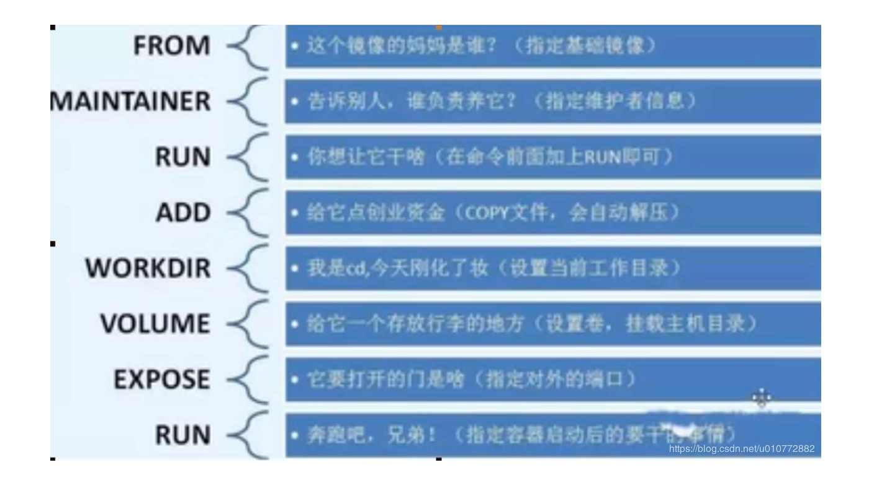
>实战测试

Docker Hub 中99%的镜像都是从这个基础镜像过来的 FROM scratch,然后配置需要的软件和配置来进行的构建
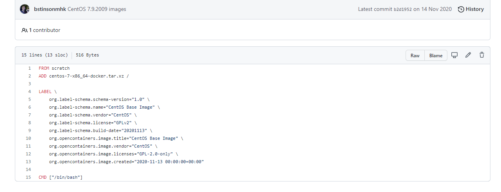
>创建一个自己的centos

```shell
# 1.编写DockerFile的文件
[root@iZbp1bjhiosovua6v1vsclZ dockerfile]# cat mydockerfile-centos   # 查看文件
FROM centos
MAINTAINER HZW<508578631@qq.com>

ENV MYPATH /usr/local
WORKDIR $MYPATH

RUN yum -y install vim
RUN yum -y install net-tools

EXPOSE 80

CMD echo $MYPATH
CMD echo "-----hzw----"
CMD /bin/bash
# 2.通过DockerFile文件进行构建镜像
构建镜像命令 docker build -f "dockerfile文件路基" -t 镜像名:[version] .
Successfully built a8724bb922cf
Successfully tagged mycentos01:latest
# 3.测试运行
```
###对比原生的centos
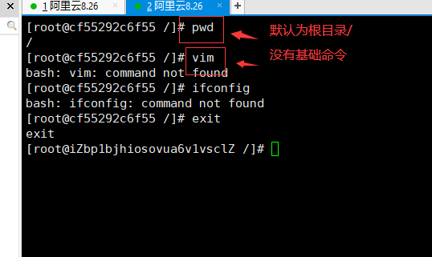
###自己用dockerfile编写的centos镜像
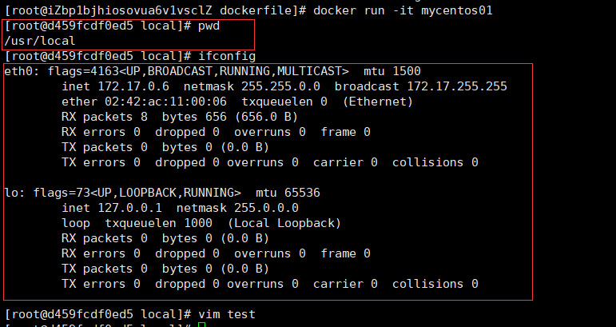

我们可以列出本地镜像的变更历史
```shell
查看镜像变更历史命令     docker history a8724bb922cf"镜像编号images"
```
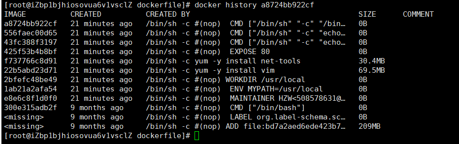
我们平时拿到一个镜像,可以研究一下它是怎么做的？

> CMD 和 ENTRYPOINT 区别

```shell
CMD    # 指定这个容器启动的时候要运行的命令,最后一个会生效,可被替代
ENTRYPOINT  #指定这个容器启动的时候要运行的命令,可以追加命令
```
测试CMD命令
```shell
# 1.编写dockerfile 文件
[root@iZbp1bjhiosovua6v1vsclZ dockerfile]# vim dockerfile-cmd-test
FROM centos
CMD ["ls","-a"]
# 2.构建镜像
[root@iZbp1bjhiosovua6v1vsclZ dockerfile]# docker build -f dockerfile-cmd-test -t cmdtest .
Sending build context to Docker daemon  3.072kB
Step 1/2 : FROM centos
 ---> 300e315adb2f
Step 2/2 : CMD ["ls","-a"]
 ---> Using cache
 ---> b17fa96bc15b
Successfully built b17fa96bc15b
Successfully tagged cmdtest:latest
# 3.run运行镜像   发现CMD命令执行了
[root@iZbp1bjhiosovua6v1vsclZ dockerfile]# docker run b17fa96bc15b
.
..
.dockerenv
bin
dev
etc
home
lib
lib64
lost+found
media
mnt
opt
proc
root
run
sbin
srv
sys
tmp
usr
var
# 4.追加一个命令 -l  ls -al
[root@iZbp1bjhiosovua6v1vsclZ dockerfile]# docker run b17fa96bc15b -l
docker: Error response from daemon: OCI runtime create failed: container_linux.go:380: starting container process caused: exec: "-l": executable file not found in $PATH: unknown.
ERRO[0000] error waiting for container: context canceled 
# cmd的清理下 -l 替换了CMD ["ls","-a"]命令, -l 不是命令所以报错
```
测试 ENTRYPOINT
```shell
[root@iZbp1bjhiosovua6v1vsclZ dockerfile]# vim dockerfile-entrypoint
[root@iZbp1bjhiosovua6v1vsclZ dockerfile]# cat dockerfile-entrypoint
FROM centos
ENTRYPOINT ["ls","-a"]
[root@iZbp1bjhiosovua6v1vsclZ dockerfile]# docker build -f dockerfile-entrypoint -t entrypoint .
Sending build context to Docker daemon  4.096kB
Step 1/2 : FROM centos
 ---> 300e315adb2f
Step 2/2 : ENTRYPOINT ["ls","-a"]
 ---> Running in 333ba18ccc23
Removing intermediate container 333ba18ccc23
 ---> 5c8ce108d276
Successfully built 5c8ce108d276
Successfully tagged entrypoint:latest
[root@iZbp1bjhiosovua6v1vsclZ dockerfile]# docker run 5c8ce108d276
.
..
.dockerenv
bin
dev
etc
home
lib
lib64
lost+found
media
mnt
opt
proc
root
run
sbin
srv
sys
tmp
usr
var

# 我们追加命令, 是可以直接拼接在我们的 ENTRYPOINT 命令后面!
[root@iZbp1bjhiosovua6v1vsclZ dockerfile]# docker run 5c8ce108d276 -l
total 56
drwxr-xr-x   1 root root 4096 Sep 14 13:50 .
drwxr-xr-x   1 root root 4096 Sep 14 13:50 ..
-rwxr-xr-x   1 root root    0 Sep 14 13:50 .dockerenv
lrwxrwxrwx   1 root root    7 Nov  3  2020 bin -> usr/bin
drwxr-xr-x   5 root root  340 Sep 14 13:50 dev
drwxr-xr-x   1 root root 4096 Sep 14 13:50 etc
drwxr-xr-x   2 root root 4096 Nov  3  2020 home
lrwxrwxrwx   1 root root    7 Nov  3  2020 lib -> usr/lib
lrwxrwxrwx   1 root root    9 Nov  3  2020 lib64 -> usr/lib64
drwx------   2 root root 4096 Dec  4  2020 lost+found
drwxr-xr-x   2 root root 4096 Nov  3  2020 media
drwxr-xr-x   2 root root 4096 Nov  3  2020 mnt
drwxr-xr-x   2 root root 4096 Nov  3  2020 opt
dr-xr-xr-x 113 root root    0 Sep 14 13:50 proc
dr-xr-x---   2 root root 4096 Dec  4  2020 root
drwxr-xr-x  11 root root 4096 Dec  4  2020 run
lrwxrwxrwx   1 root root    8 Nov  3  2020 sbin -> usr/sbin
drwxr-xr-x   2 root root 4096 Nov  3  2020 srv
dr-xr-xr-x  13 root root    0 Sep  8 12:19 sys
drwxrwxrwt   7 root root 4096 Dec  4  2020 tmp
drwxr-xr-x  12 root root 4096 Dec  4  2020 usr
drwxr-xr-x  20 root root 4096 Dec  4  2020 var
```
DockerFile 中很多命令都十分的相似，我们需要了解它们的区别, 我们最好就是对比它们然后测试效果!

>实战：Tomcat 镜像
1. 准备镜像文件 "tomcat压缩包","jdk压缩包".
2. 编写dockerfile文件,官方命名Dockerfile ，build会自动寻找这个文件，就不需要-f 指定了
```shell
FROM centos
MAINTAINET HZW<505878631@qq.com>

COPY readme.txt /usr/local/readme.txt
### ADD可以直接解压
ADD JDK.zip /usr/local/
ADD Tomcat8080.zip /usr/local/

RUN yum -y install vim

ENV MYPATH /usr/local
WORKDIR $MYPATH

ENV JAVA_HOME /usr/local/JDK
ENV CLASSPATH $JAVA_HOME/lib/dt.jar:$JAVA_HOME/lib/tools.jar
ENV CATALINA_HOME /usr/local/Tomcat8080
ENV CATALINA_BASH /usr/local/Tomcat8080
EVN PATH $PATH:JAVA_HOME/bin:$CATALINA_HOME/lib:$CATALINA_HOME/bin

EXPOSE 8080

CMD /usr/local/Tomcat8080/bin/startup.sh && tail -F /url/local/Tomcat8080/bin/logs/catalina.out
```
我们以后开发的步骤: 需要掌握Dockerfile命令的编写! 以后一起都是使用docker镜像进行发布运行!

##发布自己的镜像
>DockerHub
1. 官方地址  https://hub.docker.com/
2. 在自己服务器登录docker
```shell
[root@iZbp1bjhiosovua6v1vsclZ hzw]# docker login -u hzw20001004
Password: 
WARNING! Your password will be stored unencrypted in /root/.docker/config.json.
Configure a credential helper to remove this warning. See
https://docs.docker.com/engine/reference/commandline/login/#credentials-store

Login Succeeded
```
3. 发布镜像
```shell
[root@iZbp1bjhiosovua6v1vsclZ hzw]# 
[root@iZbp1bjhiosovua6v1vsclZ hzw]# docker images
REPOSITORY            TAG       IMAGE ID       CREATED             SIZE
diytomcat8080         latest    fb16eb6c7c09   About an hour ago   545MB
elasticsearch         7.14.0    e347b2b2d6c1   6 weeks ago         1.04GB
portainer/portainer   latest    580c0e4e98b0   6 months ago        79.1MB
centos                latest    300e315adb2f   9 months ago        209MB
# tag 把镜像改名
[root@iZbp1bjhiosovua6v1vsclZ /]# docker tag fb16eb6c7c09 hzw20001004/tomcat8080:1.5
# 发布镜像
[root@iZbp1bjhiosovua6v1vsclZ /]# docker push hzw20001004/tomcat8080:1.5
# 提交也是一层一层的
7992310e4a98: Pushing [==>                                                ]  3.869MB/69.49MB
0c67f3d9dd5a: Pushing [===========>                                       ]  2.361MB/10.52MB
9407822ffe80: Pushing [>                                                  ]  2.197MB/255.6MB
b6cfaf7277af: Pushed 
2653d992f4ef: Pushing [=>                                                 ]   4.36MB/209.3MB
```
>镜像云镜像服务上

1.登录到阿里云
2.找到容器镜像服务
3.创建命名空间
4.创建容器镜像
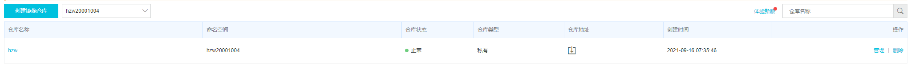
5.镜像推送到阿里云的的镜像仓库
```shell
# 登录
[root@iZbp1bjhiosovua6v1vsclZ ~]# docker login --username=迷人酥酥 registry.cn-hangzhou.aliyuncs.com
Password: 
WARNING! Your password will be stored unencrypted in /root/.docker/config.json.
Configure a credential helper to remove this warning. See
https://docs.docker.com/engine/reference/commandline/login/#credentials-store
Login Succeeded
[root@iZbp1bjhiosovua6v1vsclZ ~]# docker images
REPOSITORY               TAG       IMAGE ID       CREATED        SIZE
hzw/tomcat               1.5       fb16eb6c7c09   11 hours ago   545MB
hzw20001004/tomcat8080   1.5       fb16eb6c7c09   11 hours ago   545MB
diytomcat8080            latest    fb16eb6c7c09   11 hours ago   545MB
[root@iZbp1bjhiosovua6v1vsclZ ~]# docker push hzw20001004/tomcat8080:1.5
```
具体操作到阿里云官网看看

##小结
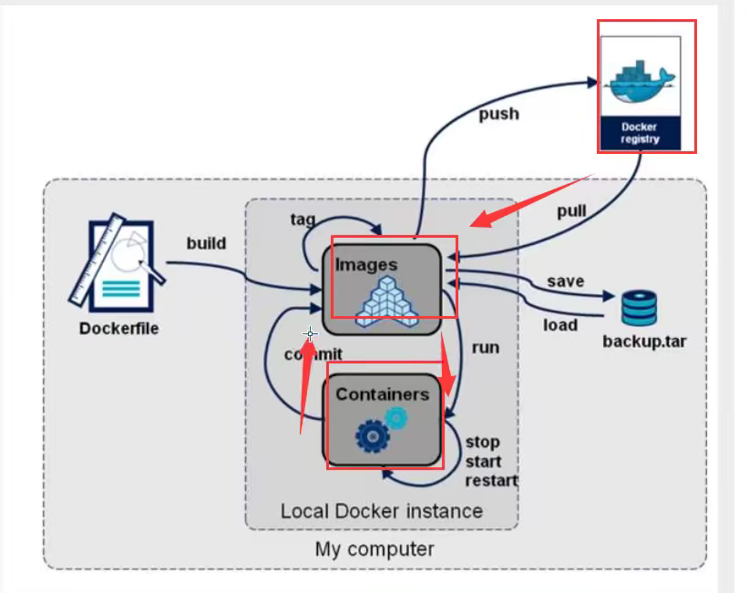
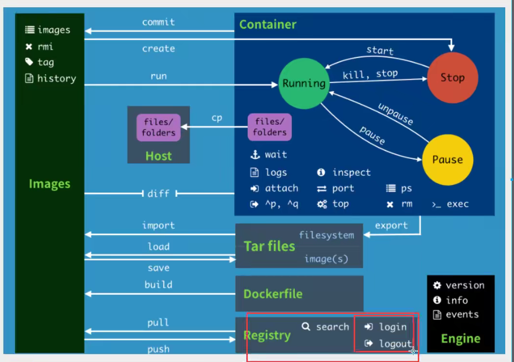


