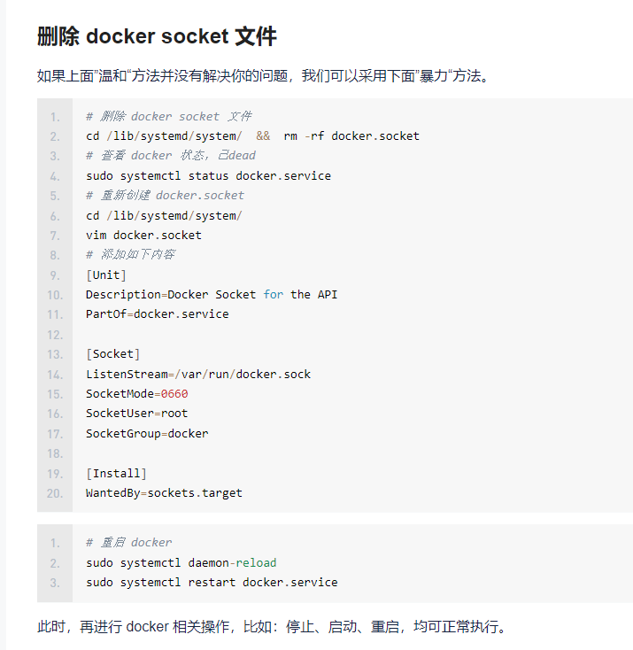

#Docker   常用命令和知识

##docker 命令
```shell
docker run -it 镜像名 /bin/bash (运行容器)
exit 或者 Ctrl+P+Q(退出容器不停止)
docker images (查询全部容器的信息)
docker ps -a (查看容器)
docker ps (查看当前所有运行容器)
docker inspect 3f7d139292ea(查看容器的信息,3f7d139292ea 为镜像名)

```

##初始Dockerfile
```shell
# Dockerfile 就是用来构建docker镜像的构建文件！ 脚本命令 
# 通过这个脚本可以生成镜像,镜像一层一层的，脚本是一个个的命令,每个命令都是一层;
```
```shell
# 创建一个dockerfile文件，名字可以自己取，
# 文件中的内容
FROM centos

VOLUME ["volume01","volume02"]

CMD echo "----cgcg----"

CMD /bin/bash

# 上面每个命令都是镜像的一层.
```

```shell
#启动下自己写的容器
```

```shell
这卷和外部一定有一个同步的目录
```

```shell
查看一下卷挂载的路径
```

```shell
验证一下文件是否同步出去了
这种方式未来使用的十分多,因为我们通常会构建自己的镜像
假设构建镜像的时候没有挂载卷,要手动自动挂载 -v 卷名 容器内路径!
```

##数据卷容器
```shell
多个MySQL同步数据
```

```shell
# 启动3个容器进行测试, 通过刚刚自己的写的镜像启动
```


```shell
得出结论,相互共享的容器,删除其中任何一个容器,不影响其他容器数据
```
>DockerFile

###dockerFile 是用来构建docker镜像的文件！ 命令参数脚本！
```shell
1.编写一个docker文件
2.docker build 构建成为一个镜像
3.docker run 运行镜像
4.docker push 发布镜像 (发布到DockerHub 阿里云镜像仓库!)
```
###查看官方是怎么做镜像的？


###很多官方镜像都是基础包,很多功能都不是很完善,我们通常会自己搭建自己的镜像!
###官方既然可以做镜像，那我们也可以做一个属于自己的镜像!
>DockerFile 构建过程

```shell
基础知识
1.每个保留关键字(指令)都是必须是大写字母
2.执行从上到下顺序执行
3.# 表示注释
4.每个指令都会生成新的镜像层,并提交!
```

```shell
dockerfile都是面向开发的,我们以后要发布项目,就需要编写dockerfile文件,这个文件十分简单
以前交付  jar war
现在交付  Docker镜像 
Docker镜像逐渐成为企业交付的标准,必须要掌握!
Docker images: 通过Docker File 构建生成的镜像,最终发布和运行的产品!
Docker容器:容器就是镜像运行起来提供服务器
```
>DockerFile 的指令

以前的话我们是使用别人的，现在我们知道了这些指令后，我们来练习自己写一个镜像！
```shell
FROM          # 基础镜像,一切从这里开始构建
MAINTAINER    #镜像是谁写的,一般格式为: 姓名+邮箱
RUN           #镜像构建的时候需要运行的命令
ADD           #步骤,tomcat镜像,这个tomcat压缩包 ! 添加内容
WORKDIR       #挂载的目录
EXPOST        #保留端口配置
CMD           #指定这个容器启动的时候运行的命令，只有最后一个会生效,可被替代
ENTTRYPOINT   #指定这个容器启动的时候要运行的命令,可以追加命令
NOBUILD       #当构建一个被继承DockerFile 这个时候就会运行NOBUILD的指令。触发指令。
COPY          #类似ADD,将我们的文件拷贝到镜像中
ENY           #构建的时候设置环境变量!
```


