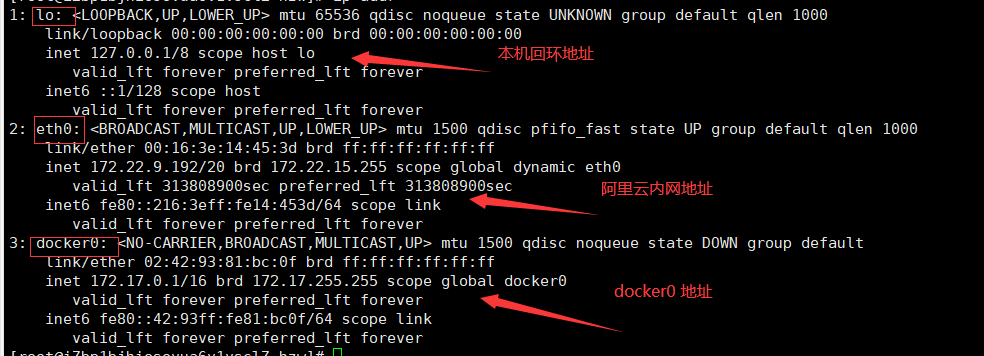
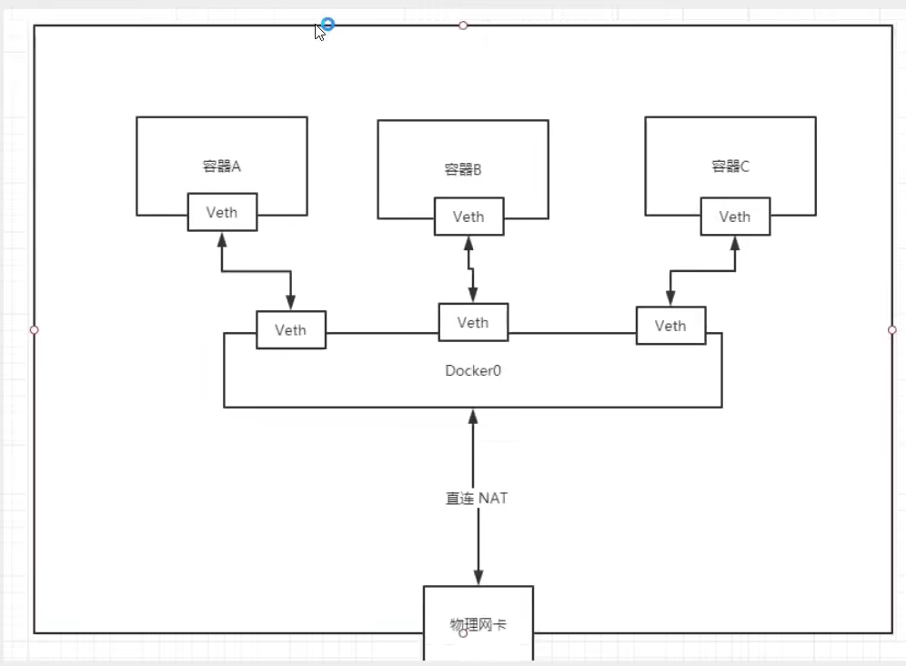

##Docker 网络 (铺垫 容器编排 集群部署 !)
>理解网络

   
###三个网络
```shell
1.docker 是如何处理容器网络问题 # 问题
2.docker run -d -P --name tomcat01 tomcat  # 启动一个tomcat
3.查看容器的内部网络地址 ip addr
4.思考  Linux能不能ping 通容器内部!
5.Linux 可以ping 通 docker 容器内部 
```
>原理

我们每启动一个docker容器,docker就会给docker容器分配一个ip，只要我们安装了docker，就会有一个docker0桥接模式,使用的技术是evth-pair技术!

```shell
发现这个容器带来的网卡,都是一对对的
ecth-pair 就是一对虚拟设备接口,他们都是成对出现的,一段连接的协议,一段彼此相连
正因为有这个特性,evth-pair 充当一个桥梁,连接各种虚拟网络设备
OpenStac,docker容器之间的连接,OVS的连接,都是使用 ecth-pair 技术
```
```shell
# docker0
结论 docker0好比就是一个路由器
所有的容器不指定网络的情况下,都是docker0路由的,docker 会给我们的容器分配一个默认的可用ip
```
>小结

Docker使用的是Linux的桥接, 宿主机中就一个Docker容器的网桥 docker0;


Docker 中所有网络接口都是虚拟的,虚拟的转发效率高! (内网传递文件!)

##--link
>思考一个场景,我们
编写一个微服务,database url=ip:  ,项目不重启的情况下,数据库ip换掉了,我们希望处理这个问题,可以名字来进行访问容器？

```shell
docker run -d -P --name tomcat03 --link tomcat02 tomcat
解决 tomcat03 和 tomcat02 网络连通
其实这个tomcat03 就是在本地配置tomcat02 的配置!
# 查看hosts配置 
[root@iZbp1bjhiosovua6v1vsclZ ~]# docker exec -it tomcat03 cat /etc/hosts
127.0.0.1	localhost
::1	localhost ip6-localhost ip6-loopback
fe00::0	ip6-localnet
ff00::0	ip6-mcastprefix
ff02::1	ip6-allnodes
ff02::2	ip6-allrouters
172.17.0.3	tomcat02 add1c5df42ea
172.17.0.4	021315688c6e

本质探究 :--link 就是我们在hosts配置中增加了一个tomcat02的映射  172.17.0.3"tomcat03的ip" tomcat02 add1c5df42ea
我们现在不推荐Docker使用--link了!
自定义网络 ! 不适应dcoker0!
docker0 问题: 它不支持容器名连接访问!
```
>自定义网络

> 网络模式
```shell
bridge : 桥接 docker (默认 自己使用桥接模式)
none : 不配置网络
host : 和宿主机共享网络
container : 容器网络联通! (用的少  局限性大)
```
```shell
1.查看所有docker网络
[root@iZbp1bjhiosovua6v1vsclZ ~]# docker network ls
NETWORK ID     NAME      DRIVER    SCOPE
8252161d025d   bridge    bridge    local
d8365435fbec   host      host      local
6d1e4069311e   none      null      local
# docker0网络的特点,默认的,域名不能访问的, --link可以打通连接!
2.我们开始自定义一个自己的网络
#创建自己的网络mynet
# --driver bridge
# --subnet 192.168.0.0/16
# --gateway 192.168.0.1
[root@iZbp1bjhiosovua6v1vsclZ ~]# docker network create --driver bridge --subnet 192.168.0.0/16 --gateway 192.168.0.1 mynet
63a13588da77ecc306c6b95d786992b5ed8ae499456cb62b4d56b11a705dbce3
#查看自己的网络mynet
[root@iZbp1bjhiosovua6v1vsclZ ~]# docker network ls
NETWORK ID     NAME      DRIVER    SCOPE
8252161d025d   bridge    bridge    local
d8365435fbec   host      host      local
63a13588da77   "mynet"     bridge    local
6d1e4069311e   none      null      local
3.查看自己创建的网络
[root@iZbp1bjhiosovua6v1vsclZ ~]# docker network inspect mynet
[
    {
        "Name": "mynet",
        "Id": "63a13588da77ecc306c6b95d786992b5ed8ae499456cb62b4d56b11a705dbce3",
        "Created": "2021-09-17T21:44:25.977560027+08:00",
        "Scope": "local",
        "Driver": "bridge",
        "EnableIPv6": false,
        "IPAM": {
            "Driver": "default",
            "Options": {},
            "Config": [
                {
                    "Subnet": "192.168.0.0/16",
                    "Gateway": "192.168.0.1"
                }
            ]
        },
        "Internal": false,
        "Attachable": false,
        "Ingress": false,
        "ConfigFrom": {
            "Network": ""
        },
        "ConfigOnly": false,
        "Containers": {},
        "Options": {},
        "Labels": {}
    }
    
4.创建二个tomcat 测试使用自己创建的网络
[root@iZbp1bjhiosovua6v1vsclZ ~]# docker run -d -P --name tomcat-net-01 --net mynet tomcat  创建tomcat-net-01
3f73541dee2975d22f34742ed14247e85b773d7b604295114b51834e0d68a31d
[root@iZbp1bjhiosovua6v1vsclZ ~]# docker run -d -P --name tomcat-net-02 --net mynet tomcat  创建tomcat-net-02
575746362dd2ac4384ece94d9367eec018de859e339b728580c67284b1e33a21
[root@iZbp1bjhiosovua6v1vsclZ ~]# docker network inspect mynet  看看网络
[
    {
        "Name": "mynet",
        "Id": "63a13588da77ecc306c6b95d786992b5ed8ae499456cb62b4d56b11a705dbce3",
        "Created": "2021-09-17T21:44:25.977560027+08:00",
        "Scope": "local",
        "Driver": "bridge",
        "EnableIPv6": false,
        "IPAM": {
            "Driver": "default",
            "Options": {},
            "Config": [
                {
                    "Subnet": "192.168.0.0/16",
                    "Gateway": "192.168.0.1"
                }
            ]
        },
        "Internal": false,
        "Attachable": false,
        "Ingress": false,
        "ConfigFrom": {
            "Network": ""
        },
        "ConfigOnly": false,
        "Containers": {
            "3f73541dee2975d22f34742ed14247e85b773d7b604295114b51834e0d68a31d": {
                "Name": "tomcat-net-01",
                "EndpointID": "4a2de173ed17df38f89e141ba44280412595e6b9cc7100cc26b2619a4a683fb0",
                "MacAddress": "02:42:c0:a8:00:02",
                "IPv4Address": "192.168.0.2/16",
                "IPv6Address": ""
            },
            "575746362dd2ac4384ece94d9367eec018de859e339b728580c67284b1e33a21": {
                "Name": "tomcat-net-02",
                "EndpointID": "f8b5a2277239dbb3078d1390a8e1c50f99872298147387401ecb76d7193609ef",
                "MacAddress": "02:42:c0:a8:00:03",
                "IPv4Address": "192.168.0.3/16",
                "IPv6Address": ""
            }
        },
        "Options": {},
        "Labels": {}
    }
]
5. 二个tomcat不需要使用到--link, 也可以进行网络连接
docker exec -it tomcat-net-01 ping tomcat-net-02    
]
```
我们自定义的网络 docker 都已经 帮我们维护好了对应关系，推荐我们平时这样使用网络 !
好处:
redis: 不同集群使用不同的网络, 保证了集群的健康和安全
mysql: 不同集群使用不同的网络, 保证了集群的健康和安全

>网络连接


