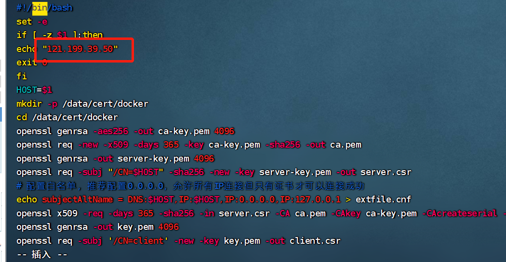
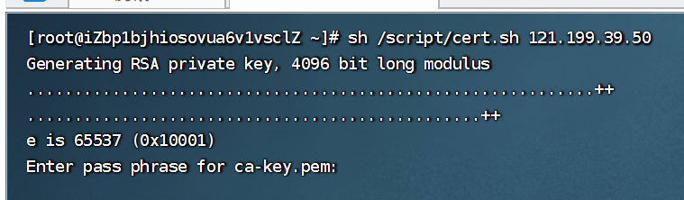
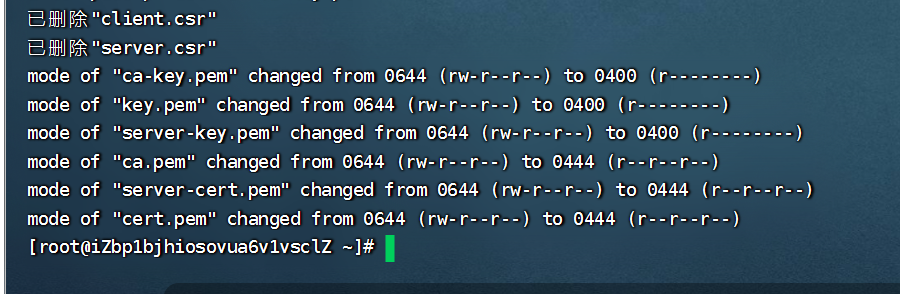
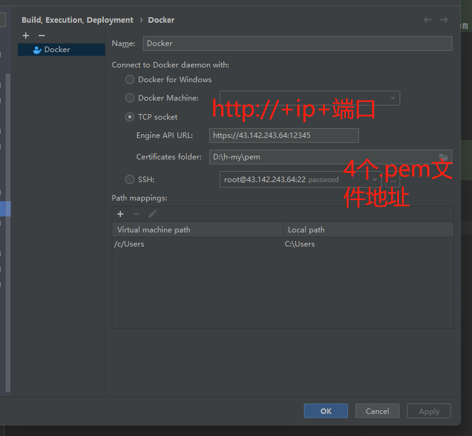
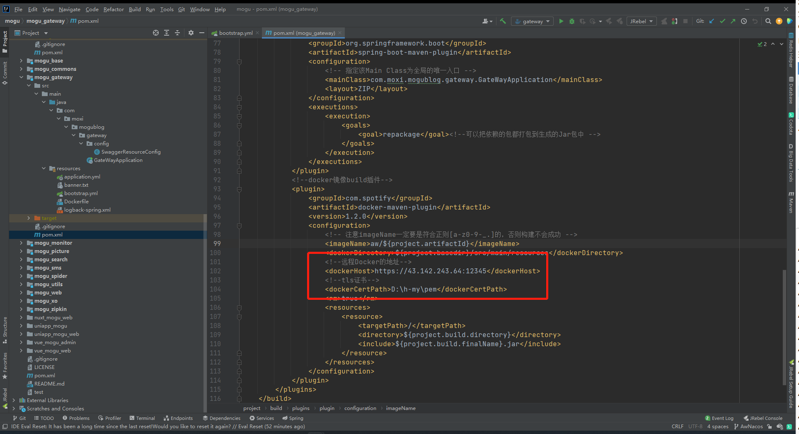

# Docker AC认证教程 解决暴露2375端口引发的安全漏洞 使用idea连接并使用Maven推送启动镜像
>创建证书生成脚本 cert.sh, 放置/script目录  

```shell
"提示" /mydata/cert/docker这个目录改了下面相关都得改 自己替换 

mkdir -p /mydata/cert/script /mydata/cert/docker #cert文件目录   
touch /mydata/cert/script/cert.sh   #创建脚本文件
vim /mydata/cert/script/cert.sh   #编辑脚本
```
>加入脚本命令 修改文本里服务器ip 保存
```shell
#!/bin/bash 
set -e
if [ -z $1 ];then
echo "服务器ip 示例192.168.1.1"
exit 0
fi
HOST=$1
mkdir -p /mydata/cert/docker
cd /mydata/cert/docker
openssl genrsa -aes256 -out ca-key.pem 4096
openssl req -new -x509 -days 365 -key ca-key.pem -sha256 -out ca.pem
openssl genrsa -out server-key.pem 4096
openssl req -subj "/CN=$HOST" -sha256 -new -key server-key.pem -out server.csr
# 配置白名单，推荐配置0.0.0.0，允许所有IP连接但只有证书才可以连接成功
echo subjectAltName = DNS:$HOST,IP:$HOST,IP:0.0.0.0,IP:127.0.0.1 > extfile.cnf
openssl x509 -req -days 365 -sha256 -in server.csr -CA ca.pem -CAkey ca-key.pem -CAcreateserial -out server-cert.pem -extfile extfile.cnf
openssl genrsa -out key.pem 4096
openssl req -subj '/CN=client' -new -key key.pem -out client.csr
echo extendedKeyUsage = clientAuth > extfile.cnf
openssl x509 -req -days 365 -sha256 -in client.csr -CA ca.pem -CAkey ca-key.pem -CAcreateserial -out cert.pem -extfile extfile.cnf
rm -v client.csr server.csr
chmod -v 0400 ca-key.pem key.pem server-key.pem
chmod -v 0444 ca.pem server-cert.pem cert.pem
```

> 执行 cert.sh 脚本, 生成证书放置 /mydata/cert/docker 目录中

```shell
#示例 sh /mydata/cert/script/cert.sh 192.168.1.1
sh /mydata/cert/script/cert.sh    (服务器ip 和上面命令的一致) 
```

> 按照提示输入相关信息,密码随便输入一致就行,其他信息可留空,等脚本指定完成之后

>脚本执行完成结果



> 可在 /mydata/cert/docker 目录查看到生成的证书 


>配置Docker启用TLS

```shell
#编辑Docker配置
vim /usr/lib/systemd/system/docker.service
# 整段复制出来改动再黏贴到服务器  不允许 \ 换行  可能会导致Docker启动失败
#端口自己改一下 记得配置开放端口和防火墙    
#/mydata/cert/docker  这个AC加密文件路径和上面创建一致 不一致自己调整
ExecStart=/usr/bin/dockerd --tlsverify --tlscacert=/mydata/cert/docker/ca.pem --tlscert=/mydata/cert/docker/server-cert.pem --tlskey=/mydata/cert/docker/server-key.pem -H tcp://0.0.0.0:12345 -H unix:///var/run/docker.sock
```
>更新并重启docker 

```shell
systemctl daemon-reload && systemctl restart docker
```
>去这个目录/mydata/cert/docker 4个文件下载到本地
```shell
ca.pem
ca-key.pem
cert.pem
key.pem
```
> idea插件连接 docker  



>Maven 连接 Docker
```shell
<!--远程Docker的地址-->
<dockerHost>https://43.142.243.64:12345</dockerHost>
<!--tls证书-->
<dockerCertPath>D:\h-my\pem</dockerCertPath>
```



