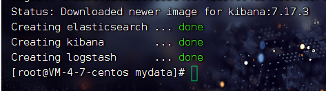

##Docker安装ELK  

> 1、 安装环境版本 
```shell
CentOS 7.6  
Docker 20    
elasticsearch:7.17.3
logstash:7.17.3
kibana:7.17.3
#开启防火墙和开启安全组端口
es的端口 9200 9300
logstash的端口 4560 4561 4562 4563
kibana的端口 5601 
```
>2、 创建目录 赋予权限

创建镜像挂载目录
```shell
mkdir mydata
mkdir mydata/elasticsearch mydata/logstash
mkdir mydata/elasticsearch/data mydata/elasticsearch/plugins
```
创建镜像挂载文件
```shell
cd mydata/logstash
vim logstash.conf
i :wq 保存文件   
```
赋予文件权限
```shell
chmod 777 mydata/elasticsearch mydata/elasticsearch/data mydata/elasticsearch/plugins mydata/logstash mydata/logstash/logstash.conf
```
>3、 使用 docker-compose.yml 安装环境

创建 docker-compose.yml 文件

把写好的docker-compose.yml文件 上传到 /mydata 地址里面
```shell
version: '3'
services:
  elasticsearch:
    image: elasticsearch:7.17.3
    container_name: elasticsearch
    restart: always
    environment:
      - "cluster.name=elasticsearch" #设置集群名称为elasticsearch
      - "discovery.type=single-node" #以单一节点模式启动
      - "ES_JAVA_OPTS=-Xms512m -Xmx1024m" #设置使用jvm内存大小
    volumes:
      - /mydata/elasticsearch/plugins:/usr/share/elasticsearch/plugins #插件文件挂载
      - /mydata/elasticsearch/data:/usr/share/elasticsearch/data #数据文件挂载
    ports:
      - 9200:9200
      - 9300:9300
  logstash:
    image: logstash:7.17.3
    container_name: logstash
    restart: always
    environment:
      - TZ=Asia/Shanghai
    volumes:
      - /mydata/logstash/logstash.conf:/usr/share/logstash/pipeline/logstash.conf #挂载logstash的配置文件
    depends_on:
      - elasticsearch #kibana在elasticsearch启动之后再启动
    links:
      - elasticsearch:es #可以用es这个域名访问elasticsearch服务
    ports:
      - 4560:4560
      - 4561:4561
      - 4562:4562
      - 4563:4563
  kibana:
    image: kibana:7.17.3
    container_name: kibana
    restart: always
    links:
      - elasticsearch:es #可以用es这个域名访问elasticsearch服务
    depends_on:
      - elasticsearch #kibana在elasticsearch启动之后再启动
    environment:
      - "elasticsearch.hosts=http://es:9200" #设置访问elasticsearch的地址
    ports:
      - 5601:5601
```
>构建镜像并运行 

切换到/mydata目录 

执行docker-compose命令
```shell
cd /mydata
docker-compose -f docker-compose.yml up -d
下图代表安装成功
```


>4、 elasticsearch 安装中文分词器 analysis-ik 插件

因为Elasticsearch版本为7.17.3 为下载 analysis-ik 版本为7.17.3  #其他版本会版本冲突

下载地址：https://github.com/medcl/elasticsearch-analysis-ik/releases

下载完成后解压到 elasticsearch 的 /mydata/elasticsearch/plugins目录下

并重命名为 analysis-ik 重启 elasticsearch 服务

重启
```shell
docker restart elasticsearch
```
下图为 analysis-ik 放置目录


> 5、 logstatsh 安装 json_lines 插件

进入logstatsh容器内部
```shell
docker exec -it logstash /bin/bash
```
安装 json_lines插件
```shell
logstash-plugin install logstash-codec-json_lines
```
logstatsh退出并重启
```shell
exit
docker restart logstash
```

> 6、 ELK 设置密码安全

进入es容器并安装vim编辑器
```shell
docker exec -it elasticsearch /bin/bash
更新 apt-get 并安装 vim 命令
apt-get update
apt-get install -y vim
```
编辑 elasticsearch.yml 配置文件
```shell
vim config/elasticsearch.yml
```
添加以下配置后保存退出
```shell
http.cors.enabled: true
http.cors.allow-origin: "*"
http.cors.allow-headers: Authorization
xpack.security.enabled: true
xpack.security.transport.ssl.enabled: true
```

添加配置后保存退出重启es
```shell
exit
docker restart elasticsearch

并再次进入 elasticsearch 容器 
docker exec -it elasticsearch /bin/bash
```
设置密码, 这里需要一直重复确认密码多次, 一直输入同一个即可
```shell
cd bin
elasticsearch-setup-passwords interactive 密码
下图初始化密码
```

验证密码是否设置成功
```shell
curl localhost:9200 -u elastic
```


7、 设置 kibana 密码


```shell

2. 用vim编辑 elasticsearch.yml 配置文件
   
加入内容
   
   
   
   
   
   
添加配置后保存退出重启es 
exit
docker restart elasticsearch
3. 再次进入 elasticsearch 容器
   docker exec -it elasticsearch /bin/bash
   cd bin
4. 设置密码, 这里需要一直重复确认密码多次, 一直输入同一个即可
   
   

```


加入内容   #可以根据自己需求改动

#监听4560 - 4563 端口来读取项目推送过来的日志
input {
  tcp {
    mode => "server"
    host => "0.0.0.0"
    port => 4560
    codec => json_lines
    type => "debug"
  }
  tcp {
    mode => "server"
    host => "0.0.0.0"
    port => 4561
    codec => json_lines
    type => "error"
  }
  tcp {
    mode => "server"
    host => "0.0.0.0"
    port => 4562
    codec => json_lines
    type => "business"
  }
  tcp {
    mode => "server"
    host => "0.0.0.0"
    port => 4563
    codec => json_lines
    type => "record"
  }
}
#filter：对于记录类型的日志，直接将JSON格式的message转化到source中去，便于搜索查看；
filter{
  if [type] == "record" {
    mutate {
      remove_field => "port"
      remove_field => "host"
      remove_field => "@version"
     }
    json {
      source => "message"
     remove_field => ["message"]
    }
  }
}

output {
  elasticsearch {
    hosts => ["es:9200"]
    codec => json
    action => "index"
#    index => "文件名称禁止大写-%{type}-%{+YYYY.MM.dd}"
    index => "springbootlog-%{type}-%{+YYYY.MM.dd}"
    template_name => "awbook"
    user => ["账号"]
    password => ["密码"]
  }
}


```


