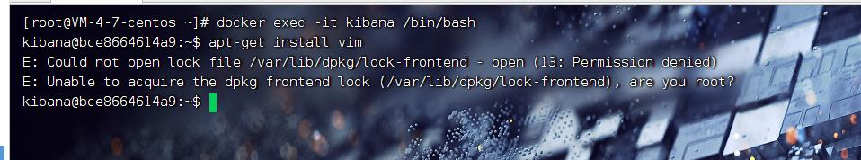

# Docker 容器内 安装vim

> 安装 vim 

```shell
#进入容器
docker exec -it 容器名称或者Id /bin/bash   

#先进行apt-get 更新
apt-get update

#安装 vim
apt-get install vim 
```
>容器没权限 安装报错 


```shell 
#进入容器加入  -u 0
docker exec -it -u 0 容器名称或者Id /bin/bash

#先进行apt-get 更新
apt-get update

#安装 vim
apt-get install vim 

#测试vim文件编辑 成功
vim test.yml
```


