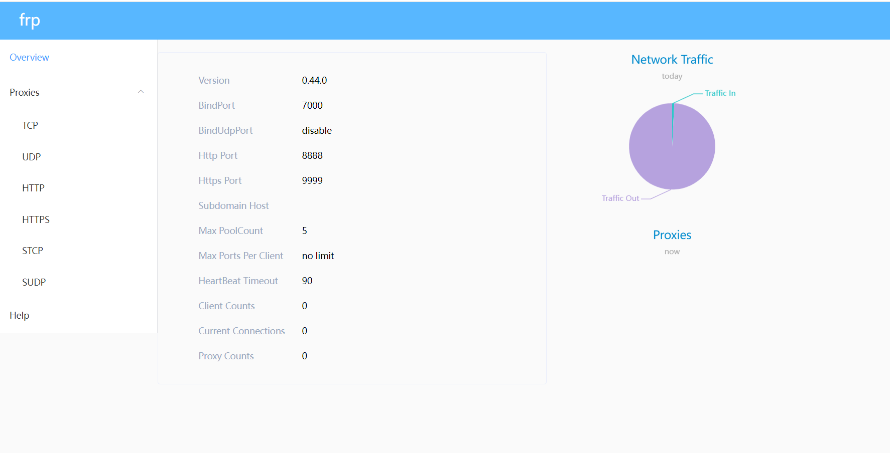
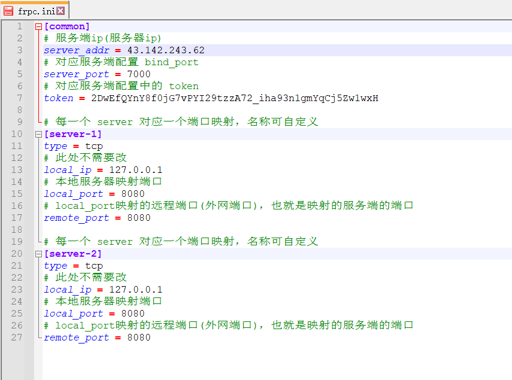
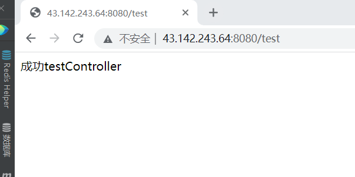

## Docker+Frp+NGinx+云服务器 实现HTTPS内网穿透

### 服务端搭建 (用docker-compose 服务器端搭建)

>前置调整
```shell
1. 一台云服务器

2. 记得在服务器安全组开放对应端口 7000 7500 8888 9999 8080 8081 80 443

3. 域名(配置https用 非强制需要)
```
frp-server --service-install frpc.exe

>创建目录和文件
```shell
# 创建存放配置文件夹
mkdir /mydata/frp

# 调整目录
cd /mydata/frp

# 创建文件
touch frps.ini
touch docker-compose-aw.yml
```
> 配置 frps.ini 
```shell
# 编辑 frps.ini
  vim frps.ini

#加入内容  密码 和 token自己替换
[common]
#绑定端口
bind_port = 7000
# 启用面板
dashboard_port = 7500
# 面板登录名和密码
dashboard_user = admin
dashboard_pwd = 123456
# 使用http代理并使用8888端口进行穿透
vhost_http_port = 8888
# 使用https代理并使用9999端口进行穿透
vhost_https_port = 9999
# 日志路径
log_file = ./frps.log
# 日志级别
log_level = info
# 日志最大保存天数
log_max_days = 2
# 认证超时时间
authentication_timeout = 900
# 认证token，客户端需要和此对应，类似于密码，建议设置复杂
token=2DwEfQYnY8f0jG7vPYI29tzzA72_iha93n1gmYqCj5Zw1wxH
# 最大连接数
max_pool_count = 5
max_ports_per_client = 0
```
> 配置 docker-compose-aw.yml 构建frp服务端
```shell
# 编辑 docker-compose-aw.yml
  vim docker-compose-aw.yml

#加入内容 构建nginx 和frp  (没有域名的可以不用安装nginx)
version: '3'
services:
  frp:
    image: snowdreamtech/frps
    container_name: frp
    restart: always
    ports:
      - 7000:7000 # 里的端口与 frps.ini 中 bind_port 保持一致
      - 7500:7500 # 里的端口与 frps.ini 中 dashboard_port 保持一致
      - 8888:8888 # 里的端口与 frps.ini 中 vhost_http_port 保持一致
      - 9999:9999 # 里的端口与 frps.ini 中 vhost_https_port 保持一致
      - 8080:8080 # 这个本地要映射出去的端口  可配置多个
      - 8081:8081 # 这个本地要映射出去的端口  可配置多个
    volumes:
      - /mydata/frps.ini:/etc/frp/frps.ini  #frps.ini 文件地址和上面创建目录一致
  nginx:
    image: nginx:1.22
    container_name: nginx
    restart: always
    volumes:
      - /mydata/nginx/nginx.conf:/etc/nginx/nginx.conf #配置文件挂载
      - /mydata/nginx/html:/usr/share/nginx/html #静态资源根目录挂载
      - /mydata/nginx/log:/var/log/nginx #日志文件挂载
    ports:
      - 80:80
      - 443:443
    links:
      - frp  #绑定frp的网络

# 执行构建服务端
  docker-compose -f docker-compose-aw.yml up -d
```

> 外网浏览器输入 服务器ip:7500, 输入配置文件中的账号密码, 登录 dashboard ,确认是否启动成功
> 


## 客户端搭建(本地搭建)

> 下载对应版本 frp 客户端文件，地址：https://github.com/fatedier/frp/releases 解压到本地

* Windows: frp_0.43.0_windows_386.zip
* MacOS: frp_0.44.0_darwin_amd64.tar.gz
* MacOS(m1): frp_0.44.0_darwin_arm64.tar.gz


> 解压找到目录中的 frpc.ini 文件，管理员模式打开编辑，编辑内容如下，记得在服务器安全组开放对应端口
```shell
[common]
# 服务端ip(服务器ip)
server_addr = xxxx  
# 对应服务端配置 bind_port
server_port = 7000
# 对应服务端配置中的 token
token = 2DwEfQYnY8f0jG7vPYI29tzzA72_iha93n1gmYqCj5Zw1wxH

# 每一个 server 对应一个端口映射，名称可自定义
[server-1]
type = tcp
# 此处不需要改
local_ip = 127.0.0.1
# 本地服务器映射端口
local_port = 8080
# local_port映射的远程端口(外网端口)，也就是映射的服务端的端口
remote_port = 8080

# 每一个 server 对应一个端口映射，名称可自定义
[server-2]
type = tcp
# 此处不需要改
local_ip = 127.0.0.1
# 本地服务器映射端口
local_port = 8080
# local_port映射的远程端口(外网端口)，也就是映射的服务端的端口
remote_port = 8080
```

> 通过命令行启动 frpc

* windows,通过cmd窗口执行
```shell
# 输入执行命令
frpc.exe
# 通过 服务器ip + remote_port 访问对应服务即可
```


* macos 通过终端执行，这里需要去 设置 -> 安全与隐私 -> 通用 -> 允许从以下位置下载的APP 点击允许才可继续执行命令
```shell
./frpc -c frpc.ini
# 需要注意的是，mac运行可能需要安装 go 的环境，若以上语句报错，则先执行
brew install go
# 通过 服务器ip + remote_port 访问对应服务即可
```
## 使用Nginx 来配置Https


