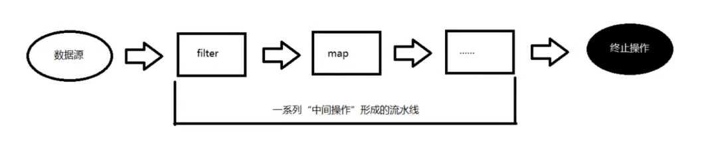
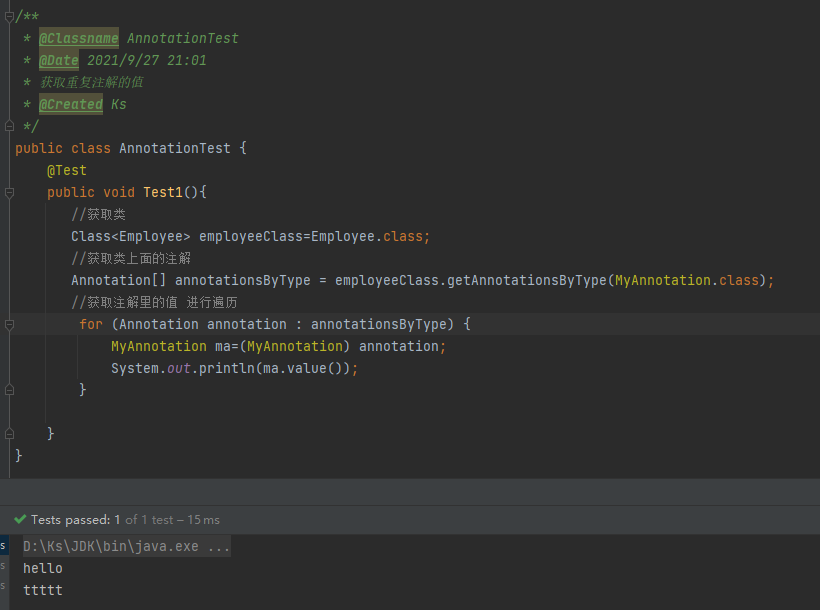

# JAVA8 新特性
##Java8 新特性简介
```text
1. 速度更快
2. 代码更少 (增加了新的语法Lambda 表达式)
3. 强大的Stream API
4. 便于并行
5. 最大化减少空指针异常Optional

重要: 其中最为核心为Lambda 表达式与Stream API
```

##主要内容
>Lambda 表达式

一 . Lambda 表达式：java8 中引入了一个新的操作符 “->” , 该操作符称为箭头操作符 或 Lambda 操作符
```shell
  该操作符将 Lambda 表达式 分为左右二部分：
  左侧：函数式接口中抽象方法的参数列表
  右侧：对函数式接口中抽象方法的实现, 即 Lambda 体
  Lambda 表达式需要函数式接口的支持 ( 函数式接口 定义：接口中只有一个抽象的接口，称为 “函数式接口”。)
```
二 . Lambda 基础语法
```shell
语法格式一: 无参数,无返回值
            写法: () -> System.out.println("java8 中的 Lambda 表达式实现函数式接口");
       语法格式二: 一个参数,无返回值
            写法: (s) -> System.out.println(s)
       语法格式三: 若方法参数只有一个参数时,返回值   (s)可以省略括号
            写法: s -> System.out.println(s)
       语法格式四: 有多个参数,并有返回值,并且Lambda 体中有多条语句
            写法: (x,y)->{
              System.out.println("Lambda 体中有多条语句");
            return Integer.compare(x.length(),y.length());
          };
       语法格式五: 若 Lambda 体中只有一条语句,大括号与 return 都可以省略不写
            写法: (x,y)-> Integer.compare(x.length(),y.length())
```
>函数式接口

一 . java8 内置四大核心函数式接口
```shell
  1. Consumer<T> 消费型接口
          void accept（T t）;
 
  2. Supplier<T> 供给型接口
          T get();
 
  3. Function<T,R> 函数型接口
          R apply(T t);
 
  4. Predicate<T> 断言型接口
          Boolean test(T t);
```
>方法引用与构造器引用

一 . 方法引用, 构造器引用,数组引用
```shell
  1. 方法引用: 若lambda 表达式, 需要实现的功能, 已经有方法提供了实现, 可以使用方法引用 (方法引用可以理解为 Lambda 表达式的另外一种表现形式)
  2. 方法引用的格式
      1. 对象的引用 :: 实例方法名
      2. 类名 :: 静态方法名
      3. 类名 :: 实例方法名
  3. 方法引用的注意：  (非常重要)
      1. 方法引用的方法参数列表与返回值类型必须与 函数式接口中 抽象方法的参数列表与返回值类型返回一致 ！
      2. 返回值类型相同的情况下, 函数式接口中抽象方法参数列表的 的一个参数, 是方法引用的调用者,
         第二个参数(无参), 是方法引用方法方法的参数时, 可以使用 类型::实例方法名
  4. 构造器引用
      格式：类名::new
  5. 数组引用
      格式：类名[]::new
```

>强大的 Stream API
> 

 一. Stream 流的操作
    1. 创建流  
    2. 中间操作
    3. 终止操作
Stream 中间操作不会做如何处理, 直到终止操作时, 一次性处理全部内容, 即 "惰性求值"
>其他新特性

一 . Optional 空指针容器类
```shell
     Optional.of(T t) : 创建一个Optional 实例
     Optional.empty() : 创建一个空的Optional 实例
     Optional.ofNullable(T t) : 若 t 不为 null, 创建Optional 实例, 否则创建空实例
     
     isPresent() : 判断是否包含值
     orElse(T t) : 如果调用对象包含值, 返回该值, 否则返回 t
     orElseGet(Supplier s) : 如果调用对象包含值, 返回该值, 否则返回 s 获取的值
     map(Dunction f) : 如果有值对其处理, 并返回处理后的 Optional, 否则返回Optional.empty()
     flatMap(Functuon mapper) : 与 map 类似, 要求返回值必须是Optional
```
二 . 重复注解

创建单个注解
```java
/**
 * @Classname MyAnnotation
 * @Date 2021/9/27 20:55
 * 单个注解
 * @Created Ks
 */
//支持重复注解
@Repeatable(MyAnnotations.class)
//程序元素
@Target({ElementType.TYPE,ElementType.FIELD,ElementType.METHOD,ElementType.PARAMETER,ElementType.CONSTRUCTOR,ElementType.LOCAL_VARIABLE})
//生命周期
@Retention(RetentionPolicy.RUNTIME)
@interface MyAnnotation {
    String value();
}
```
让单个注解支持重复注解
```java
/**
 * @Classname MyAnnotation
 * @Date 2021/9/27 20:55
 * 重复注解
 * @Created Ks
 */
//程序元素
@Target({ElementType.TYPE,ElementType.FIELD,ElementType.METHOD,ElementType.PARAMETER,ElementType.CONSTRUCTOR,ElementType.LOCAL_VARIABLE})
//生命周期
@Retention(RetentionPolicy.RUNTIME)
 @interface MyAnnotations {
    MyAnnotation[] value();
}
```
使用注解
```java
/**
 * @Classname Employee
 * @Date 2021/9/23 19:20
 * @Created Ks
 */
@Data
@ToString
@AllArgsConstructor
@NoArgsConstructor
@MyAnnotation("hello")
@MyAnnotation("ttttt")
public class Employee implements Comparable<Employee> {
    private Integer id;
    private String name;
    private Double salary;
    private Integer age;
    private Stataus stataus;

    @Override
    public int compareTo(Employee o) {
        if (this.getAge().equals(o.getAge())){
            return this.getName().compareTo(o.getName());
        }else {
            return this.getAge().compareTo(o.getAge());
        }
    }

    public enum Stataus{
        FREE,
        BUSY,
        VOCATION
    }
}
```
获取重复注解的值



