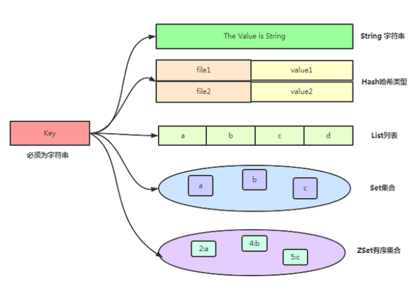

##Redis操作 Dome 

Redis 官网：https://redis.io/
Redis 特性
```text
持久化
  Redis支持RDB和AOF两种持久化机制，持久化功能有效地避免数据丢失问题，当下次Redis启动时利用之前持久化文件即可实现数据恢复。
多种数据结构
  Redis 有5种开发常见数据结构：字符串（strings）， 散列（hashMap）， 列表（lists）， 集合（set）， 有序集合（TreeSet）
支持多种客户端的语言
  Redis 支持主流的 java，PHP，python，Ruby，NodeJs 等。
功能丰富
  Redis 内置了 复制（replication），LUA脚本（Lua scripting）， LRU驱动事件（LRU eviction），事务（transactions）
  和不同级别的 磁盘持久化（persistence）， 并通过 Redis哨兵（Sentinel）和自动 分区（Cluster）提供高可用性（high availability）。
  主从复制:高可用，分布式提供基础。
  LUA脚本： 可以自定义一些命令
  事务： 支持一些简单的事务功能
  高可用性：redis-Sentinel（V2.8）支持高可用
  redis-Cluster（V3.0）支持分布式

```


###Docker安装redis
```shell
##redis 启动 和 配置
```shell
1.docker 拉取 redis
docker pull redis

2.docker启动redis
因为没有 redis.conf文件, 得先创建文件夹 再进行启动挂载
mkdir -p /mydata/redis/conf
touch /mydata/redis/conf/redis.conf
启动redis 命令
docker run -p 6379:6379 --name redis \
-v /mydata/redis/data:/data \
-v /mydata/redis/conf/redis.conf:/etc/redis/redis.conf \
-d redis redis-server /etc/redis/redis.conf

3.redis 持久化配置
echo "appendonly yes"  >> /mydata/redis/conf/redis.conf
# 重启生效
docker restart redis

4.容器随docker启动自动运行
# redis
docker update redis --restart=always
```

###Redis 5大数据结构
```shell
String: 字符串 String
  应用程序场景：非常常见的场景用于计算站点访问量、当前在线人数等。incr命令(++操作)
  
  HyperLogLogs  本质还是String 
  基于 HyperLogLogs 算发 ：极小的空间完成独立数量统计
  应用场景
     统计访问 IP 数
     计算独立用户数
  弊端
     返回的可见集合基数并不是精确值， 而是一个带有 0.81% 标准错误（standard error）的近似值。具体看你的项目是否可以容忍错误。
     无法提取出单条数据。
  
Hash: 散列 Hashmap
  应用场景：存储部分更改数据，如用户信息、会话共享 用于内容不变更的内容存储
  
List: 列表 LinkList
  应用场景：不经常变更的数据进行分页  
  reids的链表结构，可以轻松实现阻塞队列，可以使用左进右出的命令组成来完成队列的设计。
  比如：数据的生产者可以通过Lpush命令从左边插入数据，多个数据消费者，可以使用BRpop命令阻塞的“抢”列表尾部的数据。
  
Set: 集合 HashSet
  应用场景：
  共同好友、二度好友 
  利用唯一性，可以统计访问网站的所有独立 IP 
  好友推荐的时候，根据 tag 求交集，大于某个 threshold 就可以推荐
  
Sorted Set: 有序集合 TreeSet
  应用场景：
  排行榜应用  
  学生的成绩大小  

```

###Redis 2种不同形式的持久化方式
```text
1.RDB（Redis DataBase） RDB 持久性以指定的时间间隔执行数据集的时间点快照。
执行流程  
  Fork的作用是复制一个与当前进程一样的进程。新进程的所有数据（变量、环境变量、程序计数器等） 数值都和原进程一致，但是是一个全新的进程，并作为原进程的子进程
  在Linux程序中，fork()会产生一个和父进程完全相同的子进程，但子进程在此后多会exec系统调用，出于效率考虑，Linux中引入了“写时复制技术”
  一般情况父进程和子进程会共用同一段物理内存，只有进程空间的各段的内容要发生变化时，才会将父进程的内容复制一份给子进程。
操作方式
  save命令 
  Redis 处理命令的方式是以单线程形式来进行的，客户端的请求都会放入一个队列里。当执行 save 命令时，如果执行时间很长的话，后面的请求就会被阻塞，客户端发送的所有命令都会被拒绝。
  bgsave命令
  与 save 不同的是，执行过程中它并不会阻塞客户端的请求。而是将持久化工作交给子进程来执行，主进程仍负责客户端请求的处理工作。
  save m n //m 代表秒数，n 代表次数，表示 m 秒内发生 n 次变化时，会触发 bgsave。
优势
  适合大规模的数据恢复
  对数据完整性和一致性要求不高更适合使用
  节省磁盘空间
  恢复速度快
  
劣势 
  Fork的时候，内存中的数据被克隆了一份，大致2倍的膨胀性需要考虑
  虽然Redis在fork时使用了写时拷贝技术,但是如果数据庞大时还是比较消耗性能。
  在备份周期在一定间隔时间做一次备份，所以如果Redis意外down掉的话，就会丢失最后一次快照后的所有修改。
  
如何停止
  动态停止RDB：redis-cli config set save ""#save后给空值，表示禁用保存策略。

2.AOF（Append Of File）以日志的形式来记录每个写操作（增量保存）
执行流程
  客户端的请求写命令会被append追加到AOF缓冲区内；
  AOF缓冲区根据AOF持久化策略[always,everysec,no]将操作sync同步到磁盘的AOF文件中；
  AOF文件大小超过重写策略或手动重写时，会对AOF文件rewrite重写，压缩AOF文件容量；
  Redis服务重启时，会重新load加载AOF文件中的写操作达到数据恢复的目的
  
操作方式
  appendfsync always //每个写命令都同步
  appendfsync everysec //每秒同步一次
  appendfsync no //让操作系统来决定何时同步  
  auto-aof-rewrite-percentage 100 //AOF文件距离上次文件增长超过多少百分比
  auto-aof-rewrite-min-size 64mb //AOF文件体积最小多大以上触发
  
 
AOF默认不开启
  可以在redis.conf中配置文件名称，默认为 appendonly.aof
  AOF文件的保存路径和 RDB的路径一致。

AOF和RDB同时开启，redis听谁的？
  AOF和RDB同时开启，系统默认取AOF的数据（数据不会存在丢失）。
  
优势 
  备份机制更稳健，丢失数据概率更低。
  可读的日志文本，通过操作AOF稳健，可以处理误操作。
  
劣势
  比起RDB占用更多的磁盘空间。
  恢复备份速度要慢。
  每次读写都同步的话，有一定的性能压力。
  存在个别Bug，造成恢复不能。  
  
总结
用哪个好
官方推荐两个都启用。
如果对数据不敏感，可以选单独用RDB。
不建议单独用 AOF，因为可能会出现Bug。
如果只是做纯内存缓存，可以都不用。  

因为RDB文件只用作后备用途，建议只在Slave上持久化RDB文件，而且只要15分钟备份一次就够了，只保留save 900 1这条规则。
如果使用AOF，好处是在最恶劣情况下也只会丢失不超过两秒数据，启动脚本较简单只load自己的AOF文件就可以了。
代价,一是带来了持续的IO，二是AOF rewrite的最后将rewrite过程中产生的新数据写到新文件造成的阻塞几乎是不可避免的。
只要硬盘许可，应该尽量减少AOF rewrite的频率，AOF重写的基础大小默认值64M太小了，可以设到5G以上。
默认超过原大小100%大小时重写可以改到适当的数值。

```


