# Spring Cloud 基础 Dome
> ##一, 微服务 Spring cloud 基础组成

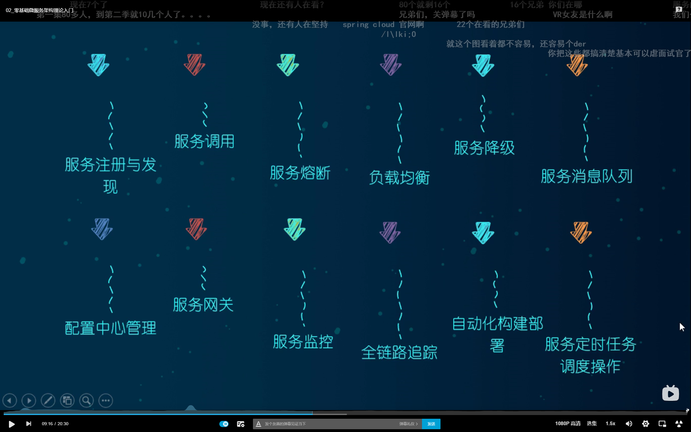
```text
1. 服务注册与发现
2. 服务调用
3. 服务熔断
4. 负载均衡
5. 服务降级
6. 服务消息队列
7. 配置中心管理
8. 服务网关
9. 服务监控
10.全链路追踪
11.自动化构建部署
12.服务定时任务调度操作

什么是微服务 ?
微服务架构是一种架构模式,它提倡将单一应用程序划分成一组小的服务,服务之间互相协调、互相配合,为用户提供最终价值.
每个服务运行在其独立的进程中,服务与服务间采用轻量级的通信机制互相协作(通常时基于 HTTP 协议的 RESTful API).
每个服务都围绕着具体业务进行构建,并且能够被独立的部署到生产环境、类生产环境等.另外,应当尽量避免统一的、
集中式的服务管理机制,对具体的一个服务而言,应根据业务上下文,选择合适的语言、工具对其进行构建.
```
> ##二, 版本选型

```shell
SpringCloud 和 SpringBoot 之间的依赖关系查看.
https://spring.io/projects/spring-cloud#overview
```
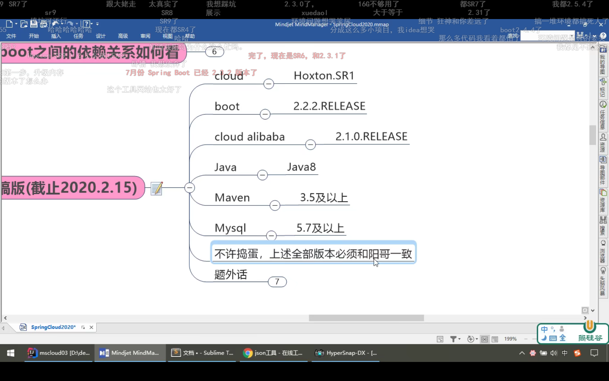

>## 三, 关于SpringCloud 各种组件的停更/升级/替换

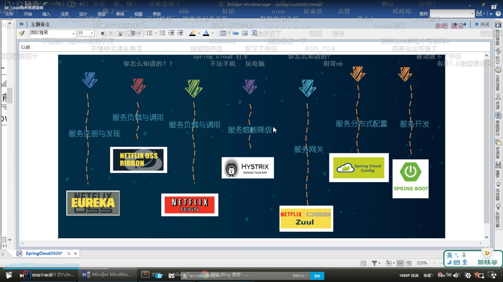

Cloud 升级
```shell
服务注册中心    (Eureka Zookeeper Consul Nacos(阿里))
服务调用       (Ribbon LoadBalancer)
服务调用2      (Feign OpenFeign)
服务降级       (Hystrix resilience4j Sentienl(阿里))
服务网关       (Zuul Zuul2 gateway)  
服务配置       (Config Nacos(阿里))
服务总线       (Nacos(阿里))
```

>学习过程 零基础 - 初级 - 中级 - 高级

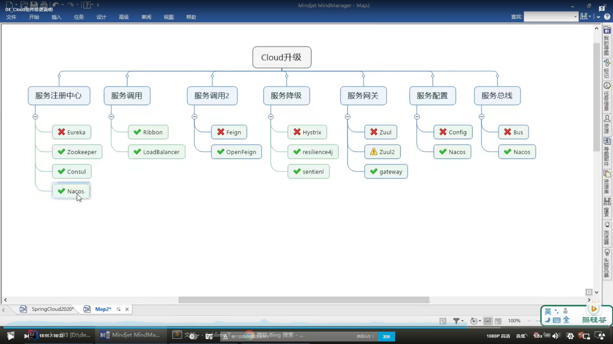
Spring Cloud 官方文档
https://cloud.spring.io/spring-cloud-static/Hoxton.SR1/reference/htmlsingle/

Spring Cloud 中文文档
https://www.bookstack.cn/read/spring-cloud-docs/docs-index.md

Spring Boot 官方文档
https://docs.spring.io/spring-boot/docs/2.2.2.RELEASE/reference/htmlsingle/

>##四, 微服务架构编码构建
### 编程风格 : 约定 > 配置 > 编码
>####编码格式调整
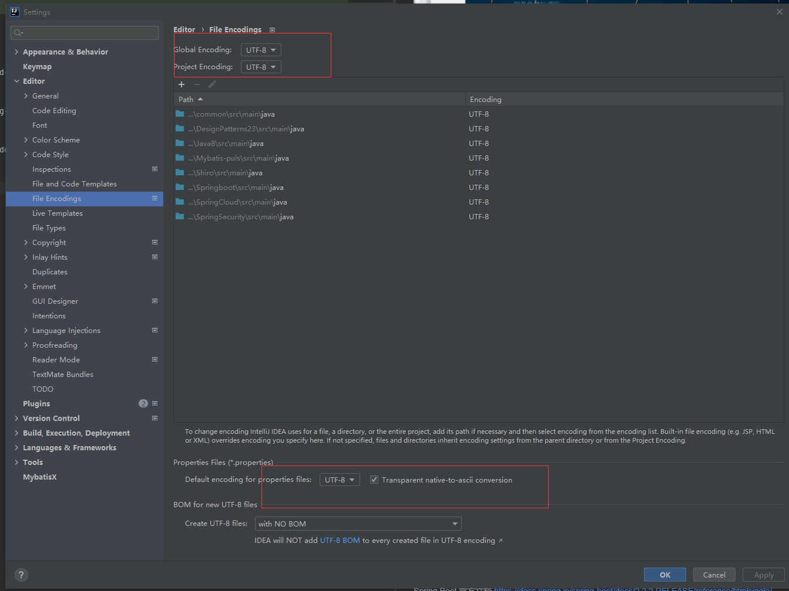

>####注解生效
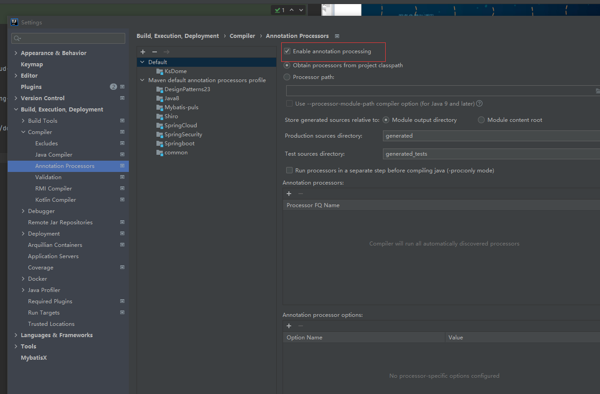
### 父pom的创建
```xml
<?xml version="1.0" encoding="UTF-8"?>

<project xmlns="http://maven.apache.org/POM/4.0.0" xmlns:xsi="http://www.w3.org/2001/XMLSchema-instance"
         xsi:schemaLocation="http://maven.apache.org/POM/4.0.0 https://maven.apache.org/xsd/maven-4.0.0.xsd">
    <modelVersion>4.0.0</modelVersion>

    <groupId>com.Ks</groupId>
    <artifactId>SpringCloud</artifactId>
    <version>0.0.1-SNAPSHOT</version>
    <packaging>pom</packaging>
    <name>SpringCloud Dome</name>


    <modules>
        <!--        <module>cloud-provider-payment8001</module>-->
    </modules>

    <!--统一管理 jar 包版本-->
    <properties>
        <spring-cloud.version>Hoxton.SR1</spring-cloud.version>
        <project.build.sourceEncoding>UTF-8</project.build.sourceEncoding>
        <maven.compiler.source>1.8</maven.compiler.source>
        <maven.compiler.target>1.8</maven.compiler.target>
        <junit.version>4.12</junit.version>
        <log4j.version>1.2.17</log4j.version>
        <lombok.version>1.18.10</lombok.version>
        <mysql.version>8.0.23</mysql.version>
        <druid.version>1.1.20</druid.version>
        <mybatis.spring.boot.version>1.3.2</mybatis.spring.boot.version>
    </properties>
    <!--子模块继承之后,提供作用：锁定版本 + 子 module 不用写 groupId 和 version -->
    <dependencyManagement>
        <dependencies>
            <!--spring boot 2.2.2-->
            <dependency>
                <groupId>org.springframework.boot</groupId>
                <artifactId>spring-boot-dependencies</artifactId>
                <version>2.2.2.RELEASE</version>
                <type>pom</type>
                <scope>import</scope>
            </dependency>
            <!--spring cloud Hoxton.SR1-->
            <dependency>
                <groupId>org.springframework.cloud</groupId>
                <artifactId>spring-cloud-dependencies</artifactId>
                <version>${spring-cloud.version}</version>
                <type>pom</type>
                <scope>import</scope>
            </dependency>
            <!--spring cloud 阿里巴巴-->
            <dependency>
                <groupId>com.alibaba.cloud</groupId>
                <artifactId>spring-cloud-alibaba-dependencies</artifactId>
                <version>2.1.0.RELEASE</version>
                <type>pom</type>
                <scope>import</scope>
            </dependency>
            <!--mysql-->
            <dependency>
                <groupId>mysql</groupId>
                <artifactId>mysql-connector-java</artifactId>
                <version>${mysql.version}</version>
            </dependency>

            <!--mybatis-->
            <dependency>
                <groupId>org.mybatis.spring.boot</groupId>
                <artifactId>mybatis-spring-boot-starter</artifactId>
                <version>${mybatis.spring.boot.version}</version>
            </dependency>
            <!-- druid-->
<!--            <dependency>-->
<!--                <groupId>com.alibaba</groupId>-->
<!--                <artifactId>druid</artifactId>-->
<!--                <version>${druid.version}</version>-->
<!--            </dependency>-->
            <!--junit-->
            <dependency>
                <groupId>junit</groupId>
                <artifactId>junit</artifactId>
                <version>${junit.version}</version>
            </dependency>
            <!--log4j-->
            <dependency>
                <groupId>log4j</groupId>
                <artifactId>log4j</artifactId>
                <version>${log4j.version}</version>
            </dependency>
        </dependencies>
    </dependencyManagement>

    <build>
        <plugins>
            <plugin>
                <groupId>org.springframework.boot</groupId>
                <artifactId>spring-boot-maven-plugin</artifactId>
                <configuration>
                    <fork>true</fork>
                    <addResources>true</addResources>
                </configuration>
            </plugin>
        </plugins>
    </build>
</project>

```
>微服务模块

```shell
  创建步骤
1 创建model
2 改POM
3 写YML
4 主程序
5 业务类
```
> idea热部署步骤
```xml
 <!-- 子工程项目导入jar -->
       <!--热部署-->
        <dependency>
            <groupId>org.springframework.boot</groupId>
            <artifactId>spring-boot-devtools</artifactId>
            <scope>runtime</scope>
            <optional>true</optional>
        </dependency>
 <!-- 父工程项目导入配置 -->
        <build>
        <finalName>Ks</finalName>
          <plugins>
            <plugin>
                <groupId>org.springframework.boot</groupId>
                <artifactId>spring-boot-maven-plugin</artifactId>
                <configuration>
                    <fork>true</fork>
                    <addResources>true</addResources>
                </configuration>
            </plugin>
          </plugins>
        </build>
```
###系统配置
1. 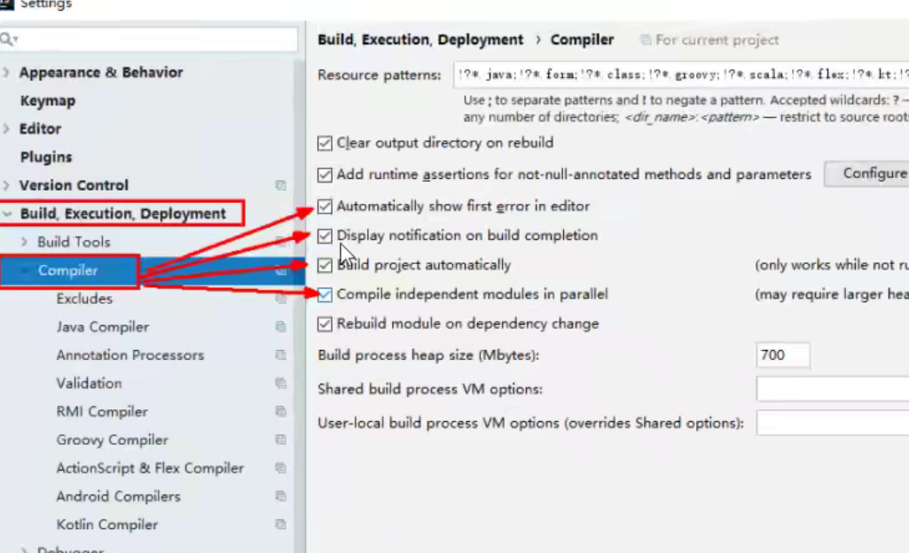
2. ctrl+shift+Alt+/    进入 Registry 勾选
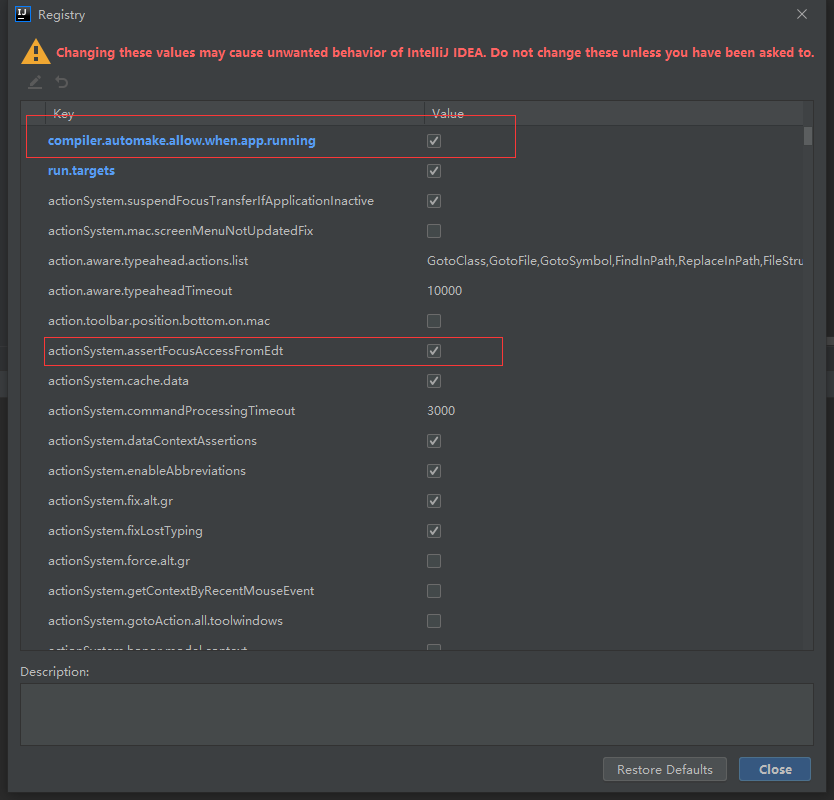
3. 重启 IDEA

>RestTemplate 

官网 : https://docs.spring.io/spring-framework/docs/5.2.2.RELEASE/javadoc-api/org/springframework/web/client/RestTemplate.html
```text
介绍
RestTemplate提供了多种便捷访问远程Http服务的方法
是一种简单的访问restful服务模板类, 是Spring提供的用于访问Rest服务的客户端模板工具集
使用
使用 restTemplate 访问 restful 接口非常的简单粗暴无脑.
(url, requestMap,ResponseBean.class)这三个参数分别代表
REST 请求地址、请求参数、HTTP响应转换被转换成的对象类型.
```

>##Eureka 基础知识

>什么是服务治理 
```text
Spring Cloud 封装了Netflix公司开发的 Eureka 模块来实现服务治理
在传统的rpc远程调用框架中, 管理每个服务与服务之间 
依赖关系比较复杂, 管理比较复杂, 所以需要使用服务治理, 管理服务与服务之间依赖关系
可以实现服务调用, 负载均衡, 容错等, 实现服务发现与注册.
```
>什么是服务注册

```text
Eureka 采用了 CS 的设计架构,Eureka Server 作为服务注册功能的服务器,它是服务注册中心.而系统中的其他微服务,
使用 Eureka 的客户端连接到 Eureka Server 并维持心跳连接.
这样系统的维护人员就可以通过 Eureka Server 来监控系统中各个微服务是否正常运行.
在服务注册与发现中,有一个注册中心.当服务器启动时,会把当前自己服务器的信息 
比如：服务地址通讯地址等以别名方式注册到注册中心上.另一方(消费者|服务提供者),
以该别名的方式去注册中心上获取到实际的服务通讯地址,然后再实现本地 RPC 调用 RPC 远程调用框架核心设计思想：
在于注册中心,因为使用注册中心管理每个服务与服务之间的一个依赖关系(服务治理概念).
在任何 RPC 远程框架中,都会有一个注册中心(存放服务地址相关信息(接口地址)).
```

>Eureka包含两个组件: Eureka Server 和 Eureka Client

```text
Eureka Server 提供服务注册服务
各个微服务节点通过配置启动后,会在 Eureka Server 中进行注册,
这样 Eureka Server 中的服务注册表中将会存储所有可用服务节点的信息,服务节点的信息可以在界面中直观看到.
Eureka Client 通过注册中心进行访问
是一个 Java 客户端,用于简化 Eureka Server 的交互,客户端同时也具备一个内置的、使用轮询(round-robin)负载算法的负载均衡器.
在应用启动后,将会向 Eureka Server 发送心跳(默认周期为 30 秒).如果 Eureka Server 在多个心跳周期内没有接收到某个节点的心跳,
Eureka Server 将会从服务注册表中把这个服务节点移除(默认90秒)
```
>Eureka 和 Dubbo 架构图解

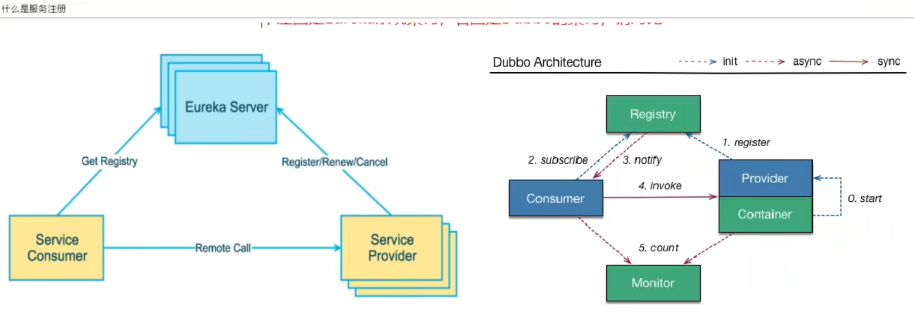

>Eureka 版本对比

```xml
<!-- 以前的老版本(2018) -->
<dependency>
    <groupId>org.springframework.cloud</groupId>
    <artifactId>spring-cloud-starter-eureka</artifactId>
</dependency>

<!-- 现在的新版本(2020) -->
<dependency>
    <groupId>org.springframework.cloud</groupId>
    <artifactId>spring-cloud-starter-netflix-eureka-server</artifactId>
</dependency>
```
>集群思想   互相注册 相互守望

>改主机映射地址 

```text
1. 找到 C:\Windows\System32\drivers\etc 路径下的 hosts 文件
2. 添加
127.0.0.1  eureka7001.com
127.0.0.1  eureka7002.com
127.0.0.1  eureka7003.com

```
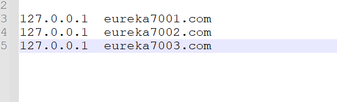

>判断这个服务是否假死

测试地址 http://192.168.1.102:8001/actuator/health

>Eureka 自我保护机制  理论知识

```text
一句话：某时刻某一个微服务不可用了,Eureka不会立刻清理, 依旧会对改微服务的信息进行保存
      属于CAP里面的AP分支
      
为什么会产生 Eureka 自我保护机制？
为了防止 EurekaClient 可以正常运行,但是与 EurekaServer 网络不通情况下,EurekaServer 不会立刻将 EurekaClient 服务剔除.

什么是自我保护模式？
默认情况下,如果 EurekaServer 在一定时间内没有接收到某个微服务实例的心跳,EurekaServer 将会注销该实例(默认90秒),
但是当网络分区故障发生(延时、卡顿、拥挤)时,微服务与 EurekaServer 之间无法正常通信,
以上行为可能变得非常危险了————因为微服务本身是健康的,此时本不应该注销这个微服务.Eureka 通过 "自我保护模式" 
来解决这个问题————当 EurekaServer 节点在短时间内丢失过多客户端时(可能发生了网络分区故障),那么这个节点就会进入自我保护模式.

在自我保护模式中,Eureka Server 会保护服务注册表中的信息,不再注销任何服务实例.

它的设计哲学就是宁可保留错误的服务注册信息,也不盲目注销任何可能健康的服务实例.一句话讲解：好死不如赖活着.

综上,自我保护模式是一种应对网络异常的安全保护措施.
它的架构哲学是宁可同时保留所有微服务(健康的微服务和不健康的微服务都会保留)也不盲目注销任何健康的微服务.
使用自我保护模式,可以让 Eureka 集群更加的健壮、稳定.
```
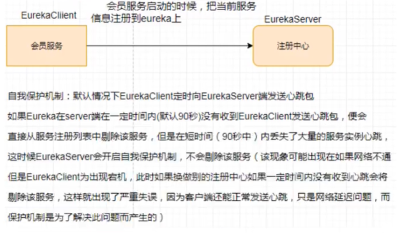
>Eureka 停止更新了你怎么办

```text
有部分公司会使用 Zookeeper 代替 Eureka 
Zookeeper是个分布式协调工具,可以实现注册中心功能
Zookeeper服务器取代Euerka服务器,zk作为服务注册中心
```


>Docker上安装ZooKeeper
> 教程地址 https://blog.csdn.net/weixin_42417934/article/details/112712676  
> 有点不一样,不过可以借鉴

```shell
我的思想步骤
本地安装虚拟机 VirtualBox
VirtualBox 安装 linux系统 Centos7  
Centos7  安装 docker 
#拉取镜像
docker pull zookeeper:3.4.9   
操作教程 https://zhuanlan.zhihu.com/p/306453731
```
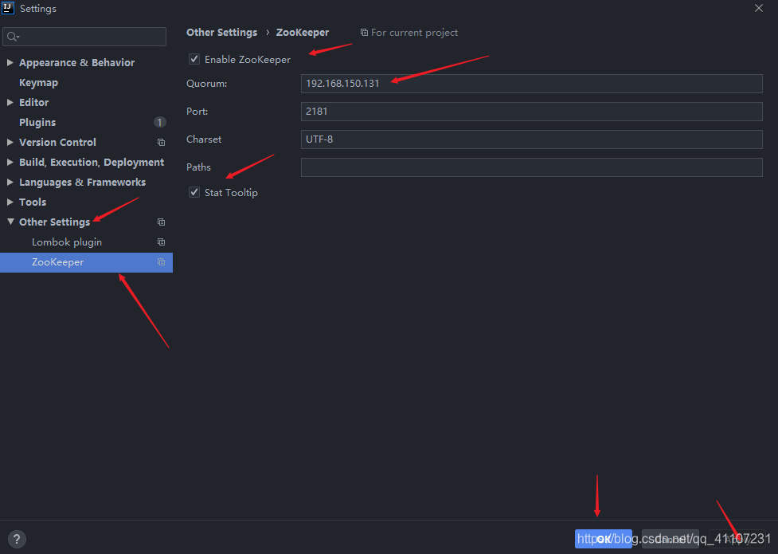
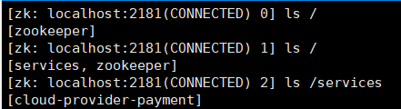

>zookeeper 四种服务节点

```text
1.临时节点
2.带序号临时节点
3.持久节点
4.带序号持久节点

服务停止一段时间没有心跳,直接剔除
```
>##Consul 服务注册与发现

>Consul 是什么

```text
官网     http://www.consul.io/intro/index.html
下载地址  https://www.consul.io/downloads
中文文档  https://www.springcloud.cc/spring-cloud-consul.html
安装教程  http://learn.hashicorp.com/consul/getting-started/install.html

Consul 是一套开源的分布式服务发现和配置管理系统, 由 hashiCorp 公司用 Go 语言开发.

提供了微服务中服务治理, 配置中心, 控制总线等功能. 这些功能中的每一个都可以根据需要单独使用, 也可以一起使用构建全方位的服务网格

总之Consul 提供了一种完整的服务网格解决方案.

服务发现： 提供 HTTP 和 DNS 两种发现方式.
健康检测： 支持多种方式,HTTP、TCP、Docker、Shell脚本定制化
KV存储 ： Key、Value的存储方式
多数据中心: Consul 支持多数据中心
可视化 Web 界面 
假如没有 阿里Nacos,Consul 将替代Eureka

我下载windows版本
操作步骤 解压 当前目录cmd进去
命令
查看版本 consul --version
启动    consul agent -dev 
访问http://localhost:8500/ 测试是否启动成功
```
>Eureka Consul Zookkeeper 比较 AP(Eureka) CP(Zookeeper/Consul)

```text
CAP 
CAP，就是Consistency、Availability、Partition Tolerence的简称，简单来说，就是一致性、可用性、分区容忍性
C全称Consistency(一致性) 这个表示所有节点返回的数据是一致的.
A全称Availability(可用性)每一个非故障节点,都能够对每一个请求做出响应.说白了就是某个节点坏了,不能影响其他的节点业务.
P全称Partition tolerance(分区容错性)当系统中有节点因网络原因无法通信时,系统依然可以继续运行.

我们了解了CAP中的三个定义,CAP定理是表示分布式系统只能满足三项中的两项,而不可能满足全部三项.
即分布式系统只能满足三种情况：CA、AP、CP.
CA 单点集群, 满足一致性, 可用性的系统, 通常在可扩展上不太强大.
CP 满足一致性, 分区容忍必的系统, 通常性能不是特别高.
AP 满足可用性, 分区容忍性的系统, 通常可能对一致性要求低一些.

CAP理论关注粒度是数据, 而不是整体系统设计的策略
```
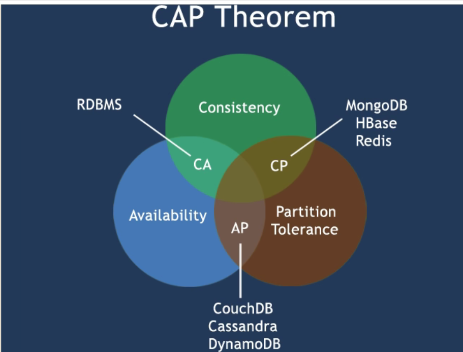
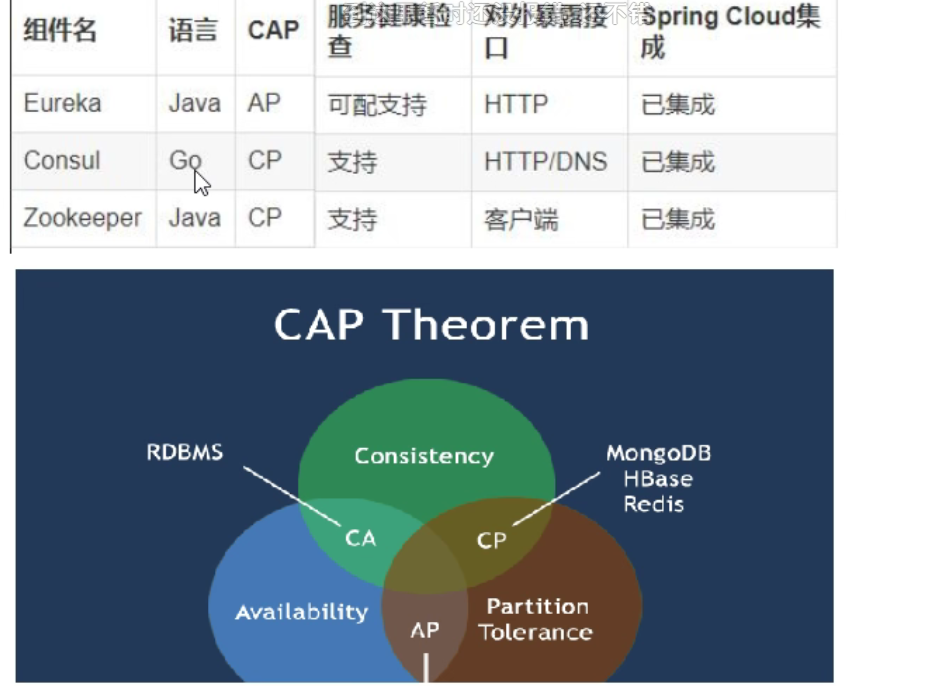

>## Ribbon 负载均衡服务调用

> Ribbon 介绍
```shell
# 官网  https://github.com/Netflix/ribbon/wiki/Getting-Started
进入维护模式  用Loabalancer代替Ribbon

Spring Cloud Ribbon 是基于 Netflix Ribbon 实现的一套客户端    负载均衡的工具
简单的说,Ribbon 是 Netflix 发布的开源项目,主要功能是提供"客户端的软件负载均衡算法和服务调用".
Ribbon 客户端组件提供一系列完善的配置项,如连接超时,重试等.
简单的说,就是再配置文件中列出 Load Balancer(简称 LB)后面所有的机器,
Ribbon 会自动的帮助你基于某种规则(如简单轮询,随机连接等)去连接这些机器.我们很容易使用 Ribbon 实现自定义的负载均衡算法.
```
> Ribbon 功能

```shell
#LB(负载均衡)
#集中式 LB
即在服务的消费方和提供方之间使用独立的 LB 设施(可以是硬件,如 F5,也可以是软件,如 nginx),
由该设施负责把访问请求通过某种策略转发至服务的提供方.
#进程内 LB
1. 将 LB 逻辑集成到消费方,消费方从服务注册中心获知有哪些地址可用,然后自己再从这些地址中选择出一个合适的服务器.
2. Ribbon 就属于进程内 LB,它只是一个类库,集成于消费方的进程,消费方通过它来获取到服务提供方的地址.

一句话: 复杂均衡+RestTemplate调用  就是Ribbon
```
> Ribbon 使用

```shell
Eureka 已经集成了Ribbon 所有直接调用使用

#Ribbon 的负载均衡策略
com.netflix.loadbalancer.RoundRobinRule  轮询
com.netflix.loadbalancer.RandomRule      随机
com.netflix.loadbalancer.RetryRule 先按照 RoundRobinRule 的策略获取服务,如果获取服务失败则在指定时间内进行重试,获取可用的服务
WeightedResponseTimeRule           对 RoundRobinRule 的扩展,响应速度越快的实例选择权重越大,越容易被选择
BestAvailableRule                  会先过滤掉由于多次访问故障而处于断路器跳闸状态的服务,然后选择一个并发量最小的服务
AvailabilityFilteringRule          先过滤掉故障实例,再选择并发较小的实例
ZoneAvoidanceRule                  默认规则,复合判断 server 所在区域的性能和 server 的可用性选择服务器


```

>RestTemplate 的使用

```shell
官网  "https://docs.spring.io/spring-framework/docs/5.2.2.RELEASE/javadoc-api/org/springframework/web/client/RestTemplate.html"

#getForObject 方法  postForObject 方法
"返回对象为响应体中数据转化成的对象,基本上可以理解为 Json"

#getForObject 方法  postForEntity 方法
"返回对象为 ResponseEntity 对象,包含了响应中的一些重要信息,比如响应头、响应状态码、响应体等"

一般推荐             #getForObject 方法  postForObject 方法
需要看详细信息可以用   #getForObject 方法  postForEntity 方法
```

>负载均衡算法：

    rest 接口第几次请求数 % 服务器集群总数量 = 实际调用服务器位置下标,每次服务重启后 rest 接口计数从 1 开始.
	List<ServiceInstance> instances = discoveryClient.getInstances("CLOUD-PAYMENT-SERVICE");
	
	如：	List[0] instances = 127.0.0.1:8002
		 List[1] instances = 127.0.0.1:8001
		 
	8001 + 8002 组合成为集群,它们共计 2 台机器,集群总数为 2,按照轮询算法原理：
	
	当总请求数为 1 时： 1 % 2 = 1 对应下标位置为 1,则获得服务地址为 127.0.0.1：8001
	当总请求数为 2 时： 2 % 2 = 0 对应下标位置为 0,则获得服务地址为 127.0.0.1：8002
	当总请求数为 3 时： 3 % 2 = 1 对应下标位置为 1,则获得服务地址为 127.0.0.1：8001
	当总请求数为 4 时： 4 % 2 = 0 对应下标位置为 0,则获得服务地址为 127.0.0.1：8002
	以此类推....
>## OpenFeign 服务接口调用

>OpenFeign 介绍
```shell
官网   "https://cloud.spring.io/spring-cloud-static/Hoxton.SR1/reference/htmlsingle/#spring-cloud-openfeign"

Fegin 是一个声明式 WebService 客户端.使用 Feign 能让编写 Web Service 客户端更加简单.
它的使用方法是定义一个服务接口然后在上面添加注解.Feign 也支持可拔插式的编码器和解码器.
Spring Cloud 对 Feign 进行了封装,使其支持了 Spring MVC 标准注解和 HttpMessageConverters.
Fegin 可以与 Eureka 和 Ribbon 组合使用以支持负载均衡.
Feign 旨在使编写 Java Http 客户端变得更容易.

前面在使用 Ribbon + RestTemplate 时,利用 RestTemplate 对 http 请求的封装处理,形成了一套模板化的调用方法.
但是在实际开发中,由于对服务依赖的调用可能不止一处,往往一个接口会被多处调用,
所以通常都会针对每个微服务自行封装一些客户端类来包装这些依赖服务的调用.
所以,Feign 在此基础上做了进一步封装,由他来帮助我们定义和实现依赖服务接口的定义.
在 Feign 的实现下,我们只需要创建一个接口并使用注解的方式来配置它
(以前是 Dao 接口上面标注 Mapper 注解,现在是一个为服务接口上面标注一个 Feign 注解即可)
,即可完成对服务提供方的接口绑定,简化了使用 Spring Cloud Ribbon 时,自动封装服务调用客户端的开发量.
利用 Ribbon 维护了 Payment 的服务列表信息,并且通过轮询实现了客户端的负载均衡.
而与 Ribbon 不同的是,通过 Feign 只需要定义服务绑定接口且以声明式的方法,优雅而简单的实现了服务调用.

#Feign 和 OpenFeign 两者区别

#Feign 
Feign 是 Spring Cloud 组件中的一个轻量级 RESTful 的 HTTP 服务客户端.
Feign 内置了 Ribbon,用来做客户端负载均衡,去调用服务注册中心的服务.
Feign 的使用方式是：使用 Feign 的注解定义接口,调用这个接口,就可以调用服务注册中心的服务.

#OpenFeign
OpenFeign 是 Spring Cloud 在 Feign 的基础上支持了 SpringMVC 的注解,如 @RequestMapping 等等.
OpenFeign 的 @FeignClient 可以解析 SpringMVC 的@RequestMapping 注解下的接口,
并通过动态代理的方式产生实现类,实现类中做负载均衡并调用其他服务.
```
>OpenFeign 功能

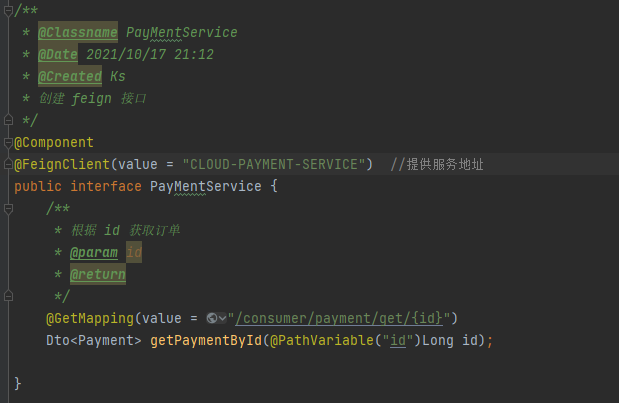
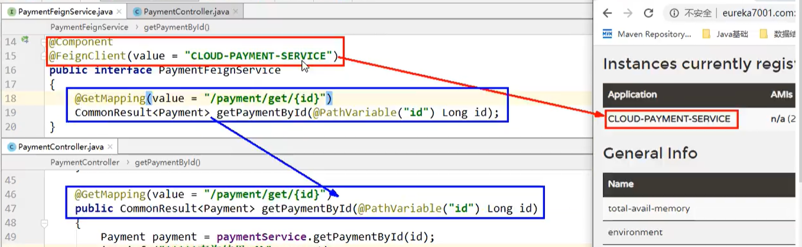

>OpenFeign 日志打印功能

```shell
Feign 提供了日志打印功能，我们可以通过配置来调整日志级别，从而了解 Feign 中 Http 请求的细节。
NONE： 默认的，不显示任何日志
BASIC： 仅记录请求方法、URL、响应状态码及执行时间；
HEADERS： 除了 BASIC 中定义的信息之外，还有请求和响应的头的信息；
FULL： 除了 HEADERS 中定义的信息之外，还有请求和响应的正文及元数据。 
```
>Hystrix 断路器

>Hystrix 是什么

```shell
官网 "https://github.com/Netflix/Hystrix/wiki/How-To-Use"
Hystrix 是一个用于处理分布式系统的延迟和容错的开源库，在分布式系统里，许多依赖不可避免的会调用失败，比如超时、异常等，
Hystrix 能够保证在一个依赖出现问题的情况下，不会导致整体服务失败，避免级联故障，以提高分布式系统的弹性。
“断路器” 本身是一种开关装置，当某个服务单元发生故障之后，通过断路器的故障监控（类似熔断保险丝），向调用方返回一个符合预期的、
可处理的备选响应（FallBack），而不是长时间的等待或者抛出调用方无法处理的异常，这样就保证了服务调用方的线程不会被长时间、
不必要地占用，从而避免了故障在分布式系统中的蔓延，乃至雪崩。
```
>Hystrix 功能

```shell
#服务降级
哪些情况会触发降级
1. 程序运行异常 2.超时 3.服务熔断触发服务降级 4.线程池 / 信号量打满也会导致服务降级
#服务垄断
类比保险丝达到最大服务访问后，直接拒绝访问，拉闸限电，然后调用服务降级的方法并返回友好提示
就是一根保险丝  服务的降级 -> 进而熔断 -> 恢复调用链路
#服务限流
秒杀高并发等操作，严禁一窝蜂的过来拥挤，大家排队，一秒钟 N 个，有序进行
```
>JMeter 安装教程  "https://blog.csdn.net/wust_lh/article/details/86095924"

>##Hystrix 服务降级

>8001生产者 服务 超时 异常 降级

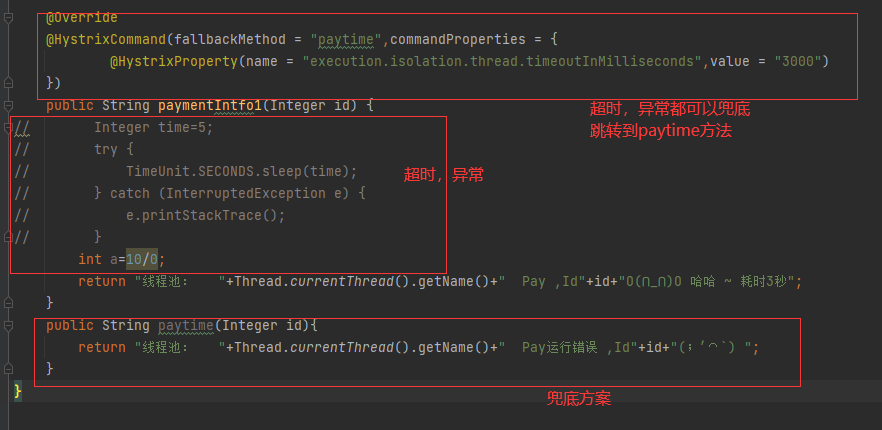
>80消费者 服务 超时 异常 降级

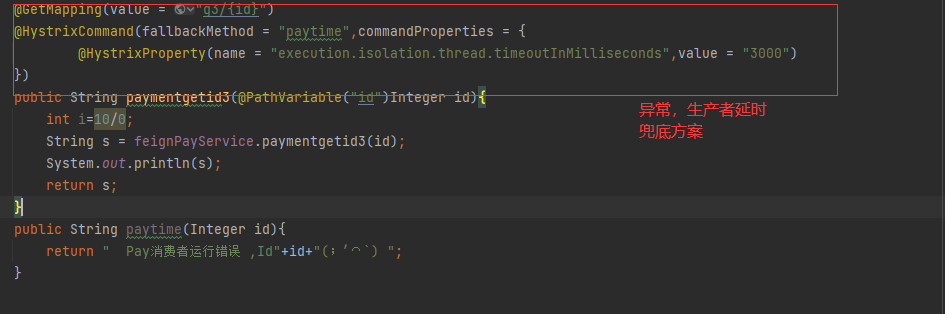
>全局通用方法 服务 超时 异常 降级    @DefaultProperties(defaultFallback = "")

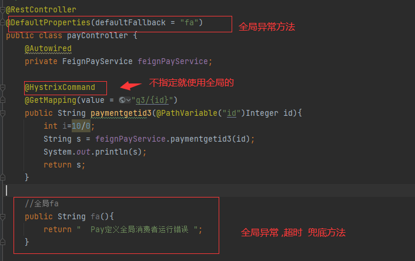

>80消费者 服务 宕机  降级

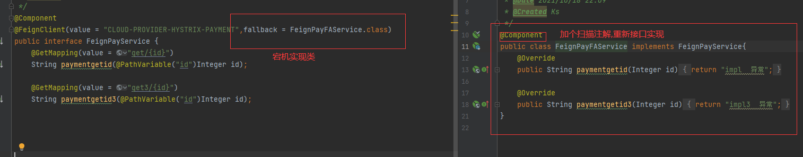

>## 服务熔断  服务的降级 》 进而熔断 》 恢复调用链路

```shell
#熔断是什么
#当检测到该节点微服务调用响应正常后，恢复调用链路。
熔断机制是应对雪崩效应的一种微服务链路保护机制。当扇出链路的某个微服务出错不可用或者响应时间太长时，
会进行服务的降级，进而熔断该节点微服务的调用，快速返回错误的响应信息。

在 Spring Cloud 框架里，熔断机制通过 Hystrix 实现。Hystrix 会监控微服务间调用的状况，当失败的调用到一定阈值，
缺省是 5 秒内 20 次调用失败，就会启动熔断机制。熔断机制的注解是 @HystrixCommand
大神论文 https://martinfowler.com/bliki/CircuitBreaker.html

开启断路器,在一段时间以内请求次数失败率达到多少进行熔断,
```

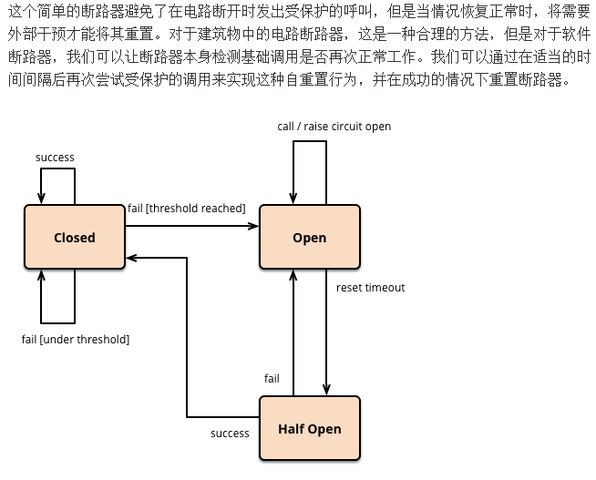

>熔断作用

```java
//++++++++++++++服务熔断
@HystrixCommand(fallbackMethod = "paymentCircuitBreaker_fallback", commandProperties = {
        // 是否开启断路器
        @HystrixProperty(name = "circuitBreaker.enabled", value = "true"),
        // 请求次数
        @HystrixProperty(name = "circuitBreaker.requestVolumeThreshold", value = "10"),
        // 时间窗口期
        @HystrixProperty(name = "circuitBreaker.sleepWindowInMilliseconds", value = "1000"),
        // 失败率达到多少后跳闸
        @HystrixProperty(name = "circuitBreaker.errorThresholdPercentage", value = "60"),
})
//涉及到断路器的三个重要参数： 快照时间窗、请求总数阀值、错误百分比阀值
//1.快照时间窗
//断路器确定是否打开需要统计一些请求和错误数据，而统计的时间范围就是快照时间窗，默认为最近的 10 秒。
//2.请求总数阀值
//在快照时间窗内，必须满足请求总数阀值才有资格熔断。
//默认为 20，意味着在 10 秒内，如果该 hystrix 命令的调用次数不足 20 次，即使所有的请求都超时或其他原因失败，断路器都不会打开。
//3.错误百分比阀值 
//当请求总数在快照时间窗内超过了阀值，比如发生了 30 次调用，如果在这 30 次调用中，有 15 次发生了超时异常，
//也就是超过 50% 的错误百分比，在默认设定 50% 阀值情况下，这时候就会将断路器打开。
/**
 * 熔断服务启动
 */
//再有请求调用的时候，将不会调用主逻辑，而是直接调用降级 fallback。
//通过断路器，实现了自动地发现错误并将降级逻辑切换为侏罗纪，减少响应延迟的效果。
/**
 * 对于这一问题，hystrix 也为我们实现了自动恢复功能。
 */
//当断路器打开，对主逻辑进行熔断之后，hystrix 会启动一个休眠时间窗，在这个时间窗内，
//降级逻辑是临时的成为主逻辑，当休眠期时间窗到期，断路器将进入半开状态，释放一次请求到原来的主逻辑上，
//如果此次请求正常返回，那么断路器将继续闭合，主逻辑恢复，如果这次请求依然有问题，断路器继续进入打开状态，休眠时间窗重新计时。
```
>Hystrix 工作流程 官网 "https://github.com/Netflix/Hystrix/wiki/How-it-Works"

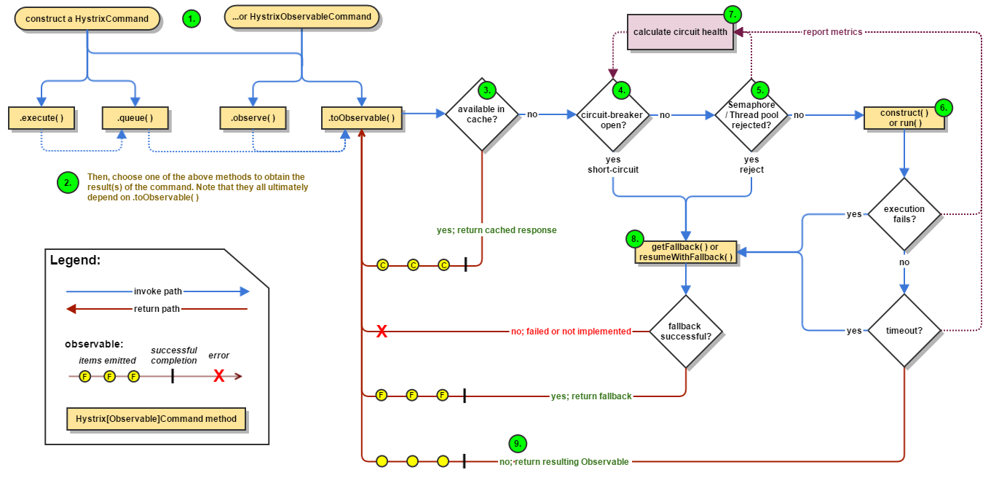
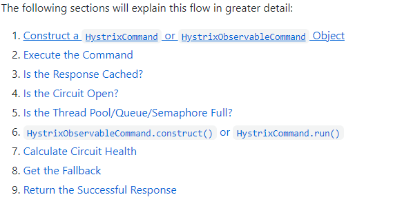

>Hystrix 监控

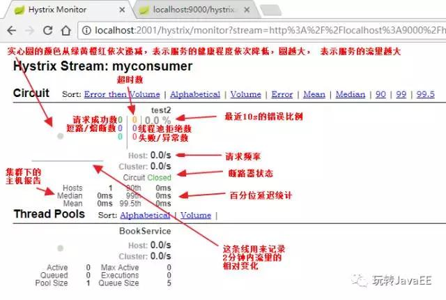
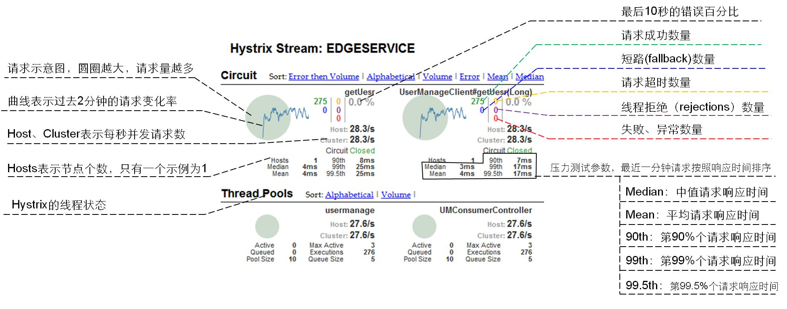
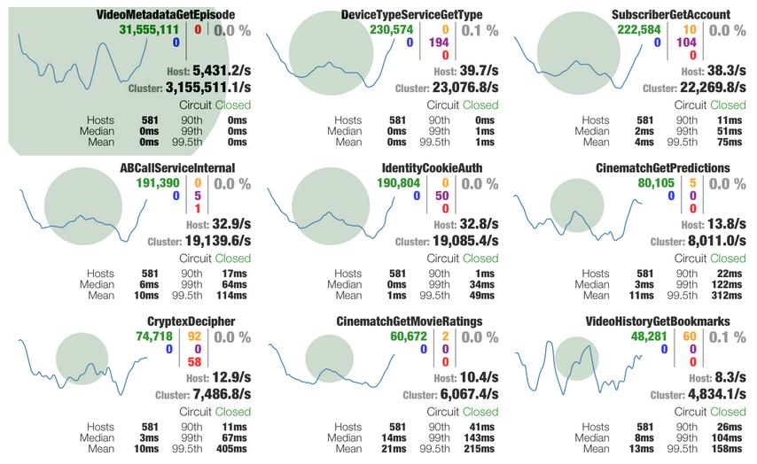
```shell
#先访问正确地址，再访问错误地址，再正确地址，会发现图示断路器都是慢慢放开的。
#服务的降级 》 进而熔断 》 恢复调用链路
```
>##Zuul 路由网关   

由于无人维护，Zuul2 迟迟未推出，已经很少有企业使用，直接用 Gateway 即可，有兴趣可自己研究。
>##Gateway 新一代网关  

>Gateway 介绍
```java
//Zuul官网     https://github.com/Netflix/zuul/wiki
//Gateway官网  https://cloud.spring.io/spring-cloud-static/spring-cloud-gateway/2.2.1.RELEASE/reference/html/

/**
 * 但是在 2.X 版本中，zuul 的升级一直跳票，SpringCloud 最后自己研发了一个网关替代 Zuul，那就是 SpringCloud Gateway；
 */
//概述
//Gateway 是在 Spring 生态系统之上构建的 API 网关服务，基于 Spring5，Spring Boot 2 和 Project Reactor 等技术。
//Gateway 旨在提供一种简单而有效的方式来对 API 进行路由，以及提供一些强大的过滤器功能，例如：熔断、限流、重试等
//SpringCloud Gateway 是 Spring Cloud 的一个全新项目，基于 Spring 5.0 + Spring Boot 2.0 和 Project Reactor 等技术开发的网关，
// 它旨在为微服务架构提供一种简单有效的统一的 API 路由管理方式。
//SpringCloud Gateway 作为 Spring Cloud 生态系统中的网关，目标是替代 Zuul，在 Spring Cloud 2.0 以上版本中，
// 没有对新版本的 Zuul 2.0 以上最新高性能版本进行集成，仍然还是使用的 Zuul 1.X 而非 Reactor 模式的老版本。
// 而为了提升网关的性能，SpringCloud Gateway 是基于 WebFlux 框架实现的，而 WebFlux 框架底层则使用了高性能的 Reactor 模式通信框架 Netty。
//SpringCloud Gateway 的目标是提供统一的路由方式且基于 Filter 链的方式提供了网关基本的功能，例如：安全，监控 / 指标，和限流。

/**
 * 一句话: SpringCloud Gateway 使用的 Webflux 中的 reactor-netty 响应式编程组件，底层使用了 Netty 通讯框架。
 */
/**
 * Gateway网关 能干什么
 */
//1.反向代理
//2.鉴权
//3.流量控制
//4.熔断
//5.日志监控
/**
 * SpringCloud Gateway 具有如下特性
 */
//基于 Spring Framework 5，Project Reactor 和 Spring Boot 2.0 进行构建；
//动态路由： 能够匹配任何请求属性；
//可以对路由指定 Predicate（断言）和 Filter（过滤器）；
//集成 Hystrix 的断路器功能；
//集成 SpringCloud 服务发现功能；
//易于编写的 Predicate（断言）和 Filter（过滤器）；
//请求限流功能；
//支持路径重写。

/**
 * Zull 1.X 缺点
 */
//servlet 是一个简单的网络 IO 模型，当请求进入 servlet container 时，servlet container 就会为其绑定一个线程，
//在并发不高的场景下，这种模型是适用的。但是一旦高并发（比如抽风用 jemeter 压），线程数量就会上涨，而线程资源代价是昂贵的
//（上线文切换，内存消耗大）严重影响请求的处理时间。在一些简单业务场景下，不希望为每个 request分配一个线程，
//只需要 1 个或几个线程就能应对极大并发的请求，这种业务场景下 servlet 模型没有优势。
//所以 Zuul 1.X 是基于 servlet 之上的一个阻塞式处理模型，即 spring 实现了处理所有 request 请求的一个 servlet（DispatcherServlet）
//并由该 servlet 阻塞式处理处理。所以 SpringCloud Zuul 无法摆脱 servlet 模型的弊端。

/**
 *   GateWay 模型 基于  WebFlux 
 *   WebFlux 是什么？
 *   WebFlux  官网  https://docs.spring.io/spring-framework/docs/current/reference/html/web-reactive.html#spring-webflux
 */
//传统的 Web 框架，比如说：struts2，springmvc 等都是基于 Servlet API 与 Servlet 容器基础之上运行的。
//但是在 Servlet 3.1 之后有了异步非阻塞的支持。而 WebFlux 是一个典型非阻塞异步的框架，它的核心是基于 Reactor 的相关 API 实现的。
// 相对于传统的 web 框架来说，它可以运行在诸如 Netty，Undertow 及支持 Servlet3.1 的容器上。
// 非阻塞式 + 函数式编程（Spring5 必须让你使用 java8）。
//Spring WebFlux 是 Spring 5.0 引入的新的响应式框架，区别于 Spring MVC，它不需要依赖 Servlet API，
// 它是完全异步非阻塞的，并且基于 Reactor 来实现响应式流规范。

/**
 * 三大核心概念
 * Route(路由)  路由是构建网关的基本模块，它由 ID，目标 URI，一系列的断言和过滤器组成，如果断言为 true 则匹配该路由
 * 路由配置：分二种：yal文件内配置   config bean配置 
 * 动态路由配置：用微服务名称进行动态路由负载均衡
 * Rredicate(断言)参考的是 Java8 的 java.util.function.Predicate 开发人员可以匹配 HTTP 请求中的所有内容（例如请求头或请求参数），如果请求与断言相匹配则进行路由
 *             # 断言，路径相匹配的进行路由
 #            - Query=username, \d+  # 要有参数名称并且是正整数才能路由
 #            - Method=GET
 #            - Host=**.sgj.com
              - Header=X-Request-Id, \d+   # 请求头中要有X-Request-Id属性并且值为整数的正则表达式
 #            - Cookie=username,zzyy
 #            - After=2021-11-20T10:59:34.102+08:00[Asia/Shanghai]
 #            - Before=2021-05-20T10:59:34.102+08:00[Asia/Shanghai]
 #            - Between=2021-05-20T10:59:34.102+08:00[Asia/Shanghai],2021-05-22T10:59:34.102+08:00[Asia/Shanghai]
 
 * Filter(过滤)  指的是 Spring 框架中 GatewayFilter 的实例，使用过滤器，可以在请求被路由前或者之后对请求进行修改。
 * */

```
网关概念图
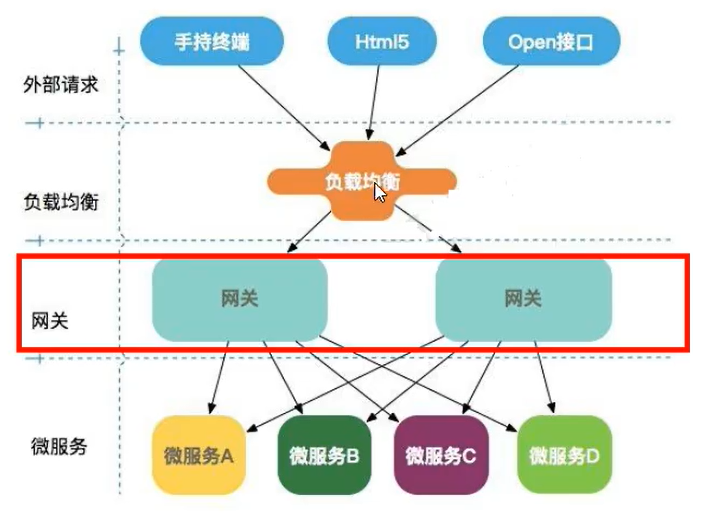
Servlet2.5 概念图
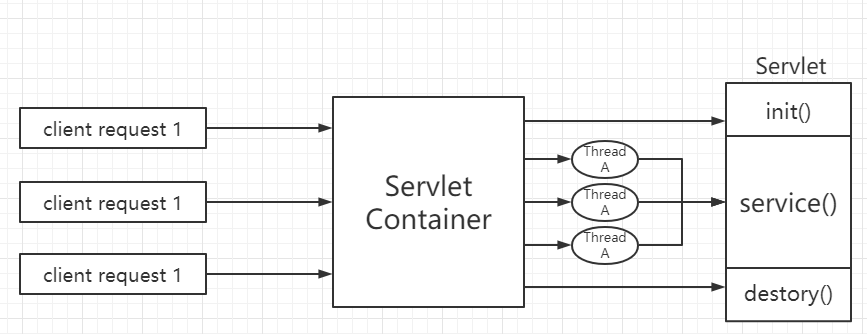
自定义网关 Filtre
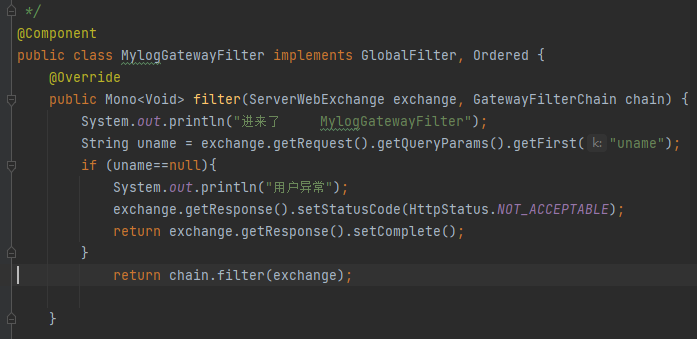

>##Config 服务配置 

>Config 服务配置 介绍
```shell
# 官网  "https://cloud.spring.io/spring-cloud-static/spring-cloud-config/2.2.1.RELEASE/reference/html/"

微服务意味着要将单体应用中的业务拆分成一个个子服务。每个服务的粒度相对较小，因此系统中会出现大量的服务。
由于每个服务都需要必要的配置信息才能运行，所以一套集中式的、动态的配置管理设施是必不可少的。
SpringCloud 提供了 ConfigServer 来解决这个问题，我们每一个微服务自己带着一个 application.yml，上百个配置文件的管理有点太冗余了

#怎么用
SpringCloud Config 分为服务端和客户端两部分。
服务端也称为分布式配置中心，它是一个独立的微服务应用，用来连接配置服务器并为客户端提供获取配置信息，加密 / 解密信息等访问接口
客户端则是通过指定的配置中心来管理应用资源，以及与业务相关的配置内容，
并在启动的时候从配置中心获取和加载配置信息配置服务器默认采用 git 来存储配置信息，这样就有助于对环境配置进行版本管理，
并且可以通过 git 客户端工具来方便的管理和访问配置内容。

#能干什么
集中管理配置文件
不同环境不同配置，动态化的配置更新，分环境部署比如 dev / test / prod / beta / release
运行期间动态调整配置，不再需要在每个服务部署的机器上编写配置文件，服务会向配置中心统一拉取配置自己的信息。
当配置发生变动时，服务不需要重启即可感知到配置的变化并应用新的配置。
将配置信息以 Rest 接口的形式暴露
post、curl 访问刷新均可......
```
```shell
#label：分支（branch）
#name：服务名
#profiles：环境（dev / test / prod）
```
> Spring Cloud Bus  实现分布式自动刷新配置功能

```shell
#什么是总线
在微服务架构的系统中，通常会使用轻量级的消息代理来构建一个共用的消息主题，并让系统中所有微服务实例都连接上来。
由于该主题中产生的消息会被所有实例监听和消费，所以称它为消息总线。在总线上的各个实例，
都可以方便地广播一些需要让其他连接该主题上的实例都知道的消息。
#总线的基本原理
ConfigClient 实例都监听 MQ 中同一个 topic（默认是 SpringCloudBus）。当一个服务刷新数据的时候，
它会把这个信息放入到 Topic 中，这样其它监听同一 Topic 的服务就能得到通知，然后去更新自身的配置。
```
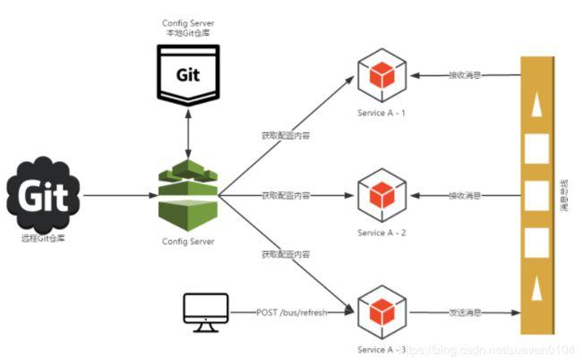

> Spring cloud Stream 消息驱动

>Stream 是什么
```shell
官网 "https://spring.io/projects/spring-cloud-stream#overview"
例如和后端与大数据对接，后端用的消息中间件为 RabbitMQ，
而大数据用的是 Kafka，如果不引入 SpringCloud Stream，就需要学习两套 MQ，费时费力。
一句话  屏蔽底层消息中间件的差异，降低切换成本，统一消息的编程模型
```
>Stream 使用

```shell
#Middleware
中间件，目前只支持 RabbitMQ 和 Kafka
#Binder
Binder 是应用与消息中间件之间的封装，目前实行了 Kafka 和 RabbitMQ 的 Binder，
通过 Binder 可以很方便的连接中间件，可以动态的改变消息类型（对应与 Kafka 的 topic，RabbitMQ 的 exchange），
这些都可以通过配置文件来实现。
#@Input
注解标识输入通道，通过该输入通道接收到的消息进入应用程序
#@Output
注解标识输出通道，发布的消息将通过该通道离开应用程序
#@StreamListener
监听队列，用于消费者的队列的消息接收
#@EnableBinding
指信道 channel 和 exchange 绑定在一起
```
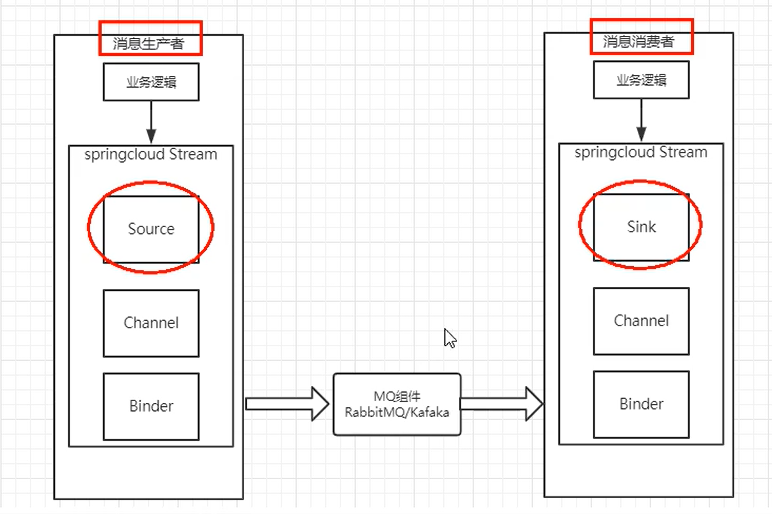

>服务注册中心对比

```shell
CAP，就是Consistency、Availability、Partition Tolerence的简称，简单来说，就是一致性、可用性、分区容忍性
#Nacos 支持 AP 和 CP 模式的切换
C 是所有节点在同一时间看到的数据是一致的；
而 A 的定义是所有的请求都会收到响应。
何时选择使用何种模式？
一般来说，如果不需要存储服务级别的信息且服务实例是通过 nacos-client 注册，并能够保持心跳上报，那么就可以选择 AP 模式。
当前主流的服务如 SpringCloud 和 Dubbo 服务，都适用于 AP 模式，AP 模式为了服务的可能性而减弱了一致性，因此 AP 模式下只注册临时实例。
如果需要在服务级别编辑或者存储配置信息，那么 CP 是必须， K8S 服务和 DNS 服务则适用于 CP 模式。
CP 模式下则支持注册持久化实例，此时则是以 Raft 协议为集群运行模式，该模式下注册实例之前必须先注册服务，如果服务不存在，则会返回错误。
curl -X PUT '$NACOS_SERVER:8848/nacos/v1/ns/operator/switches?entry=serverMode&value=CP'
```
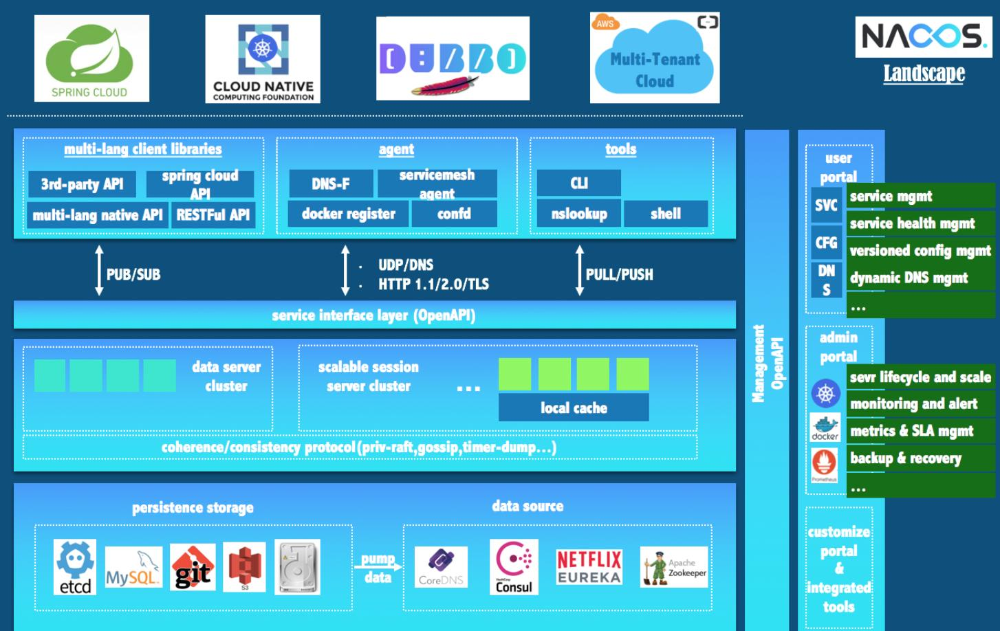
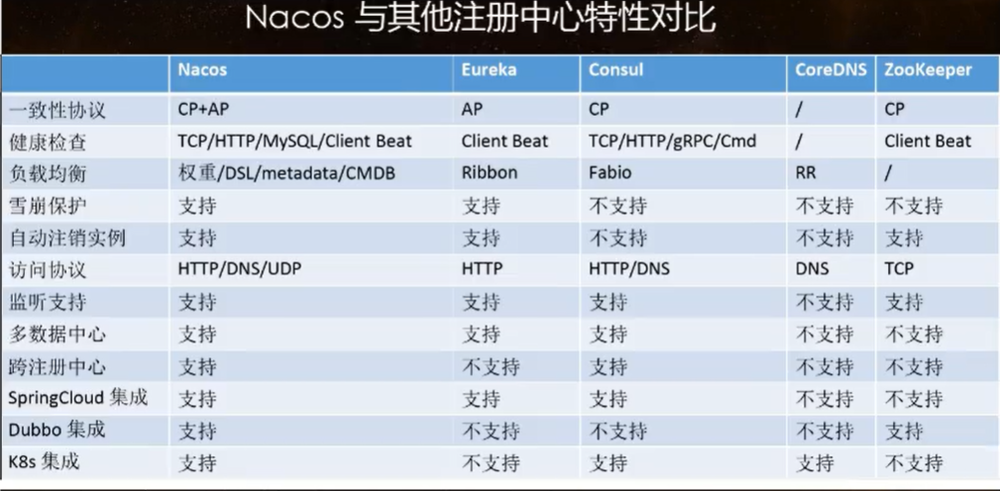
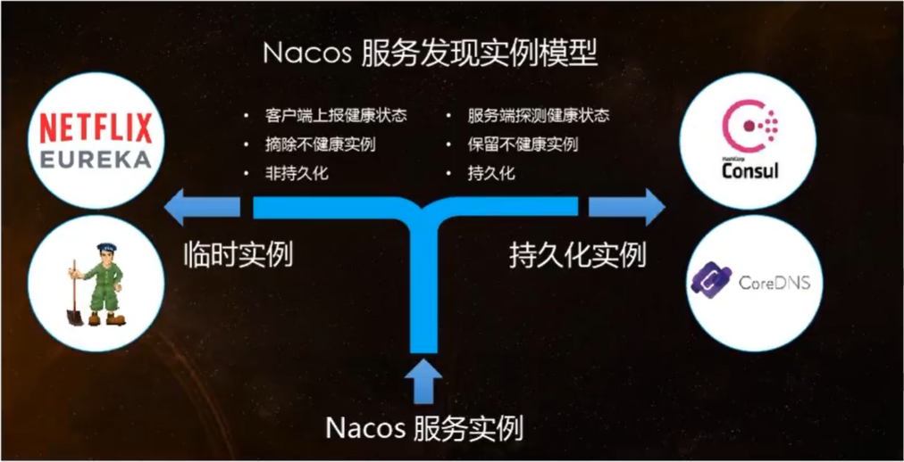


