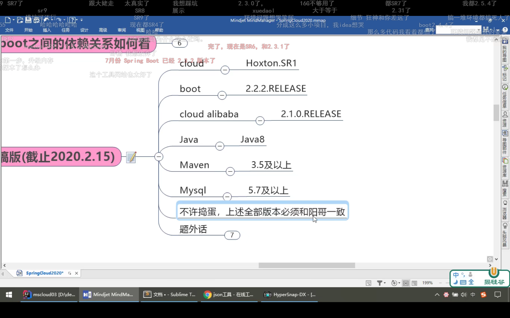
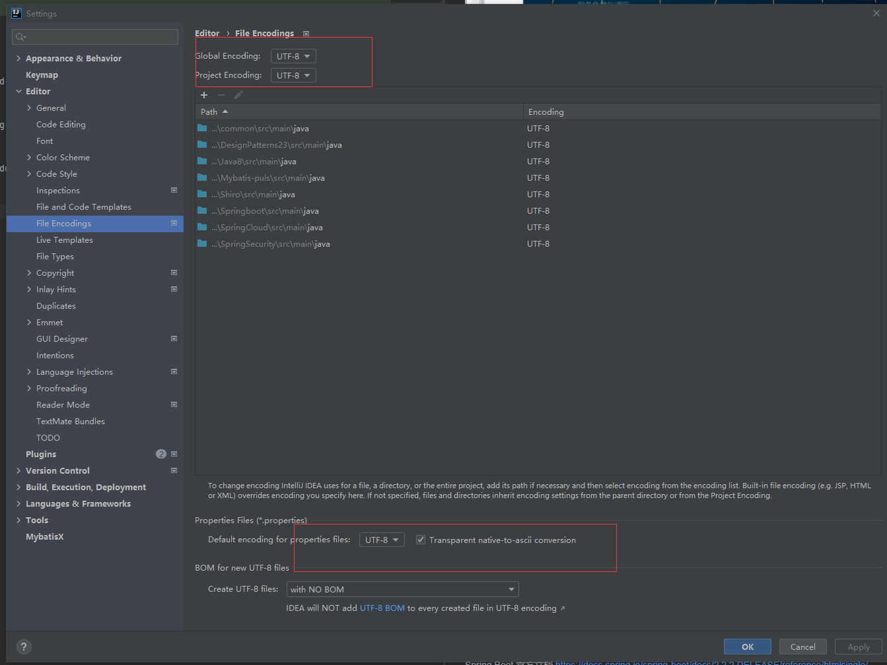
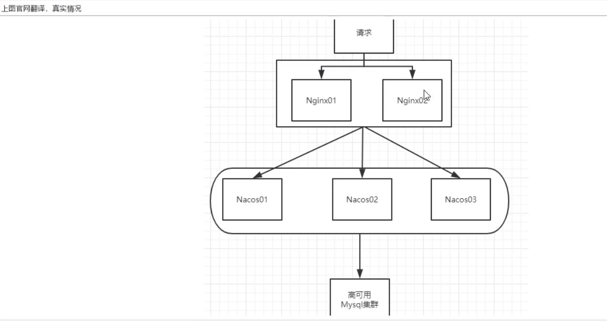
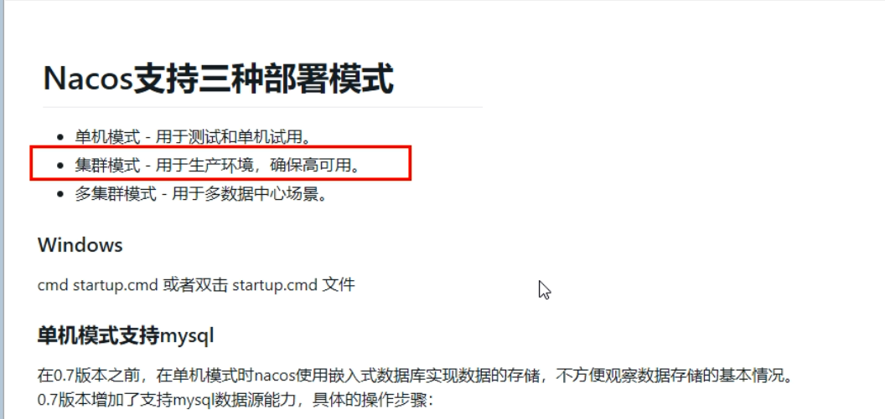
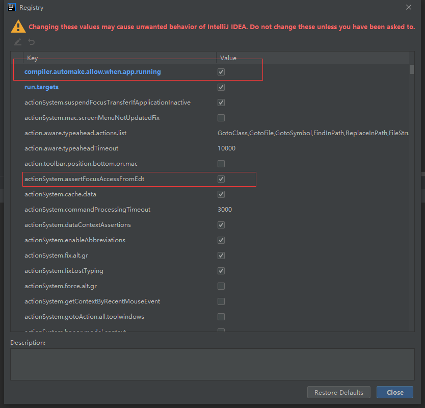
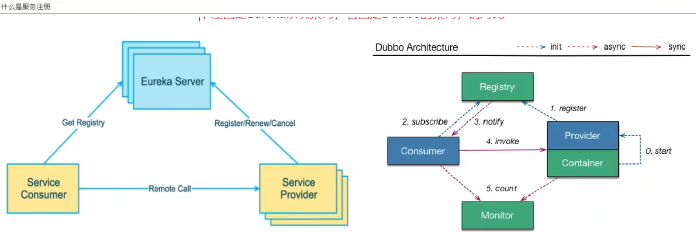

## SpringCloud Alibaba 学习

>##SpringCloud Alibaba
>最新版本安装地址   https://github.com/alibaba/nacos/releases

>SpringCloud Alibaba 介绍


```shell
   #为什么会出现 SpringCloud alibaba
#1. SpringCloud Netflix 项目进入了维护模式
   官网 "https://spring.io/blog/2018/12/12/spring-cloud-greenwich-rc1-available-now"
   Spring Cloud Netflix Projects Entering Maintenance Mode
   
#2. SpringCloud Alibaba 
   官网 "https://github.com/alibaba/spring-cloud-alibaba/blob/master/README-zh.md"   
   诞生 "2018.10.31，SpringCloud Alibaba 正式入驻了 SpringCloud 官方孵化器，并在 Maven 中央库发布了第一个版本。"

#3. SpringCloud Alibaba 能干什么呢
服务注册与发现
	适配 Spring Cloud 服务注册与发现标准，默认集成了 Ribbon 的支持。
分布式配置管理
	支持分布式系统中的外部化配置，配置更改时自动刷新。
消息驱动能力
	基于 Spring Cloud Stream 为微服务应用构建消息驱动能力。
分布式事务
	使用 @GlobalTransactional 注解， 高效并且对业务零侵入地解决分布式事务问题。
阿里云对象存储
	阿里云提供的海量、安全、低成本、高可靠的云存储服务。支持在任何应用、任何时间、任何地点存储和访问任意类型的数据。
分布式任务调度
	提供秒级、精准、高可靠、高可用的定时（基于 Cron 表达式）任务调度服务。同时提供分布式的任务执行模型，如网格任务。网格任务支持海量子任务均匀分配到所有 Worker（schedulerx-client）上执行。
阿里云短信服务
	覆盖全球的短信服务，友好、高效、智能的互联化通讯能力，帮助企业迅速搭建客户触达通道。
服务限流降级
	默认支持 WebServlet、WebFlux, OpenFeign、RestTemplate、Spring Cloud Gateway, Zuul, Dubbo 和 RocketMQ 限流降级功能的接入，可以在运行时通过控制台实时修改限流降级规则，还支持查看限流降级 Metrics 监控。

#4. SpringCloud Alibaba 系类产品
Sentinel
	阿里巴巴开源产品，把流量作为切入点，从流量控制、熔断降级、系统负载保护等多个维度保护服务的稳定性。
Nacos
	阿里巴巴开源产品，一个更易于构建云原生应用的动态服务发现、配置管理和服务管理平台。
RocketMQ
	Apache RocketMQ™ 基于 Java 的高性能、高吞吐量的分布式消息和流计算平台。
Dubbo
	Apache Dubbo™ 是一款高性能 Java RPC 框架。
Seata
	阿里巴巴开源产品，一个易于使用的高性能微服务分布式事务解决方案。
Alibaba Cloud OSS
	阿里云对象存储服务（Object Storage Service，简称 OSS），是阿里云提供的海量、安全、低成本、高可靠的云存储服务。
您可以在任何应用、任何时间、任何地点存储和访问任意类型的数据。
Alibaba Cloud SchedulerX
	阿里中间件团队开发的一款分布式任务调度产品，支持周期性的任务与固定时间点触发任务。

#5. SpringCloud alibaba 学习资料获取
https://spring.io/projects/spring-cloud-alibaba#overview
SpringCloud Alibaba 致力于提供微服务开发的一站式解决方案。此项目包含开发分布式应用微服务的必需组件，方便开发者通过 Spring Cloud 编程模型轻松使用这些组件来开发分布式应用服务。
依托 SpringCloud Alibaba，您只需要添加一些注解和少量配置，就可以将 SpringCloud 应用接入阿里微服务解决方案，通过阿里中间件来迅速搭建分布式应用系统。
SpringCloud Alibaba 进入了 SpringCloud 官方孵化器，而且毕业了
https://github.com/alibaba/spring-cloud-alibaba
https://spring-cloud-alibaba-group.github.io/github-pages/greenwich/spring-cloud-alibaba.html
https://github.com/alibaba/spring-cloud-alibaba/blob/master/README-zh.md

```
>##SpringCloud Alibaba Nacos 服务注册和配置中心

> SpringCloud Alibaba Nacos 简介

```shell
#为什么叫 Nacos
前四个字母分别为 Naming 和 Configuration 的前两个字母，最后的 s 为 Service
#Nacos 是什么
一个更易于构建云原生应用的动态服务发现、配置管理和服务管理平台。
Nacos：Dynamic Naming and Configuration Service
Nacos 就是注册中心 +  配置中心的组合
等同于 Nacos = Eureka + Config + Bus
#Nacos 能干什么？
替代 Eureka 做服务注册中心
替代 Config 做服务配置中心
# Nacos 文档
https://github.com/alibaba/Nacos
官网文档
https://nacos.io/zh-cn/index.html
https://spring-cloud-alibaba-group.github.io/github-pages/greenwich/spring-cloud-alibaba.html#_spring_cloud_alibaba_nacos_discovery
#Nacos 安装 运行
本地 Java 8 + Maven 环境已经 OK
https://github.com/alibaba/nacos/releases
解压安装包，直接运行 bin 目录下的 startup.cmd
命令运行成功后直接访问 http://localhost:8848/nacos
默认账号密码都是 nacos
```

> Nacos 作为服务注册中心演示

```shell
#官网文档
https://spring-cloud-alibaba-group.github.io/github-pages/greenwich/spring-cloud-alibaba.html#_spring_cloud_alibaba_nacos_discovery
#配置文件支持注解
@RefreshScope
通过 Spring Cloud 原生注解 @RefreshScope 实现配置自动更新
# 设置 DataId
${spring.application.name}-${spring.profile.active}.${spring.cloud.nacos.config.file-extension}
prefix 默认为 spring.application.name 的值
spring.profile.active 即为当前环境对应的 profile,可以通过配置项 spring.profile.active 来配置
file-extension 为配置内容的数据格式，可以通过配置项 spring.cloud.nacos.config.file-extension 来配置
```
>Nacos 作为配置中心-分类配置

```shell
#多环境多项目管理
问题一：实际开发中，通常一个系统会准备
dev 开发环境
test 测试环境
prod 生产环境
如何保证指定环境启动时服务能正确读取到 Nacos 上相应环境的配置文件呢？

问题二: 一个大型分布式微服务系统会有很多微服务子项目，每个微服务项目又都会有相应的开发环境、测试环境、预发环境、正式环境......
那么怎么对这些微服务配置进行管理呢？
#Namespace + Group + Data ID 三者关系？为什么这么设计？
类似 Java 里面的 package 名和类名
最外层的 namespace 是可以用于区分部署环境的，Group 和 DataID 逻辑上区分两个目标对象。
Namespace = public，Group = DEFAULT_GROUP，默认 Cluster 是 DEFAULT
Naocs 默认的命名空间是 public，Namespace 主要用来隔离。
比方说我们现在有三个环境：开发、测试、生产环境，我们就可以创建三个 NameSpace，不同的 Namespace 之间是隔离的。
Group 默认是 DEFAULT_GROUP，Group 可以把不同的微服务划分到同一个分组里面去
Service 就是微服务；一个 Service 可以包含多个 Cluster（集群），Nacos 默认 Cluster 是 DEFAULT，Cluster 是对指定微服务的一个虚拟划分。
比方说为了容灾，将 Service 微服务分别部署在了杭州机房和广州机房，这时就可以给杭州机房 的 Service 微服务起一个集群名称（HZ），给广州机房的 Service 微服务起一个集群名称（GZ），还可以尽量让同一个机房的微服务互相调用，以提升性能。
最后就是 Instance，就是微服务的实例。

#三种方案加载配置
1.DataID 方案
指定 spring.profile.active 和配置文件的 DataID 来使不同环境下读取不同的配置
默认空间 + 默认分组 + 新建 dev 和 test 两个 DataID
	新建 dev 配置 DataID
		nacos-config-client-dev.yaml
	新建 test 配置 DataID
		nacos-config-client-test.yaml
通过 spring.profile.active 属性就能进行多环境下配置文件的读取
2.Group 方案
在 config 下增加一条 group 的配置即可。
可配置为 DEV_GROUP 或 TEST_GROUP
3.Namespace 方案
```


>Nacos 集群和持久化配置 （超级重要）

```shell
官网  "https://nacos.io/zh-cn/docs/cluster-mode-quick-start.html"
1. Nacos 默认自带的是嵌入式数据库 derby
	https://github.com/alibaba/nacos/blob/develop/config/pom.xml
2.Nacos 持久化配置解释
	Nacos 默认自带的是嵌入式数据库 derby
		https://github.com/alibaba/nacos/blob/develop/config/pom.xml
	derby 到 mysql 切换配置步骤
		nacos-server-1.1.4\nacos\conf 目录下找到 sql 脚本
			nacos-mysql.sql
	  
		nacos-server-1.1.4\nacos\conf 目录下找到 application.properties
		  
		注意，这里需要最少 5.6 以上的 mysql，如果为8.0 以上，建议更换 nacos 版本为 1.3.1 以上
	启动 Nacos，可以看到是个全新的空记录界面，以前是记录进 derby
	新添加的所有配置都会进入对应的数据库中
	
直接双击startup.cmd=startup命令 此时是以集群模式启动服务->失败（"nacos is starting with cluster"）
使用命令行添加启动模式 startup -m standalone->成功("nacos is starting with standalone")	
3.Linux 版 Nacos + MySQL 生产环境配置
预计需要，1 个 Nginx + 3 个 Nacos 注册中心 + 1 个 mysql
Nacos Linux 下载 "https://github.com/alibaba/nacos/releases/tag/1.1.4"


```



>Sentinel   实现熔断与限流

>Sentinel 是什么

```shell
官网 "https://github.com/alibaba/Sentinel"
一句话 ：就是Hystrix
解决的问题
服务雪崩
服务降级
服务熔断
服务限流
下载地址 "https://github.com/alibaba/Sentinel/releases"

流控模式
当关联的资源达到阈值时，就限流自己
当与 A 关联的资源 B 达到阈值后，就限流自己
B 惹事，A 挂了

流控效果
直接失败
预热  限流 冷启动 10/3 在一定时间内到10
排队等待  

熔断降级
RT    平均响应时间   超出阈值  且  在时间窗口内通过的请求 >= 5，两个条件同时满足后触发降级
异常比例   QPS >= 5 且异常比例（秒级统计）超过阈值时，触发降级；时间窗口结束后，关闭降级
异常数    异常数（分钟统计）超过阈值时，触发降级；时间窗口结束后，关闭降级。

@SentinelResource
分为系统默认和客户自定义，两种
	之前的 case，限流出问题后，都是用 sentinel 系统默认的提示： Blocked by Sentinel（flow limiting）
	我们能不能自定义，类似 Hystrix，某个方法出问题了，就找对应的兜底降级方法？
从 HystrixCommand 到 @SentinelResource

热点key
案例演示了第一个参数 p1，当 QPS 超过 1 秒 1 次点击后马上被限流

参数例外项
	特例情况
		普通
			超过 1 秒钟 1 个后，达到阈值 1 后马上被限流
		我们期望 p1 参数当它是某个特殊值时，它的限流值和平时不一样
		特例
			假如当 p1 的值等于 5 时，它的阈值可以达到 200
	
系统规则
配置全局 QPS 尝试即可，一般不会具体配置，容易被修改掉

@SentinelResource 使用
资源名称锁定限流 @SentinelResource(value = "byResource", blockHandler = "handleException") 
也可以用请求地址 限流 @GetMapping("/byResource")
com.alibaba.csp.sentinel.slots.block.flow.FlowException  兜底异常底层类

指定 自定义兜底方法 
@SentinelResource(value = "customerBlockHandler", 
blockHandlerClass = CustomerBlockHandler.class, blockHandler = "handlerException2")

@SentinelResource 的简单运用
// @SentinelResource(value = "fallback") // 没有配置
// @SentinelResource(value = "fallback", fallback = "handlerFallback") // fallback 只负责业务异常
// @SentinelResource(value = "fallback", blockHandler = "blockHandler") // blockHandler 只负责 Sentinel 控制台配置违规
// @SentinelResource(value = "fallback", fallback = "handlerFallback", blockHandler = "blockHandler")  //业务和控制台 
@SentinelResource(value = "fallback", fallback = "handlerFallback", blockHandler = "blockHandler", exceptionsToIgnore = {IllegalArgumentException.class})  //忽略异常

```




